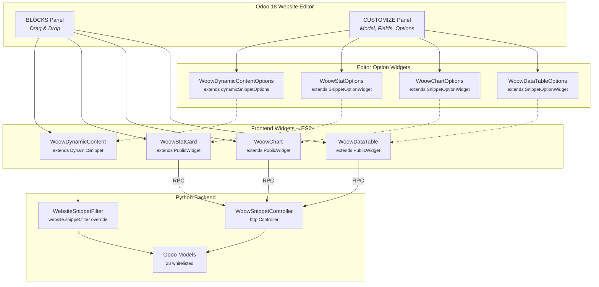
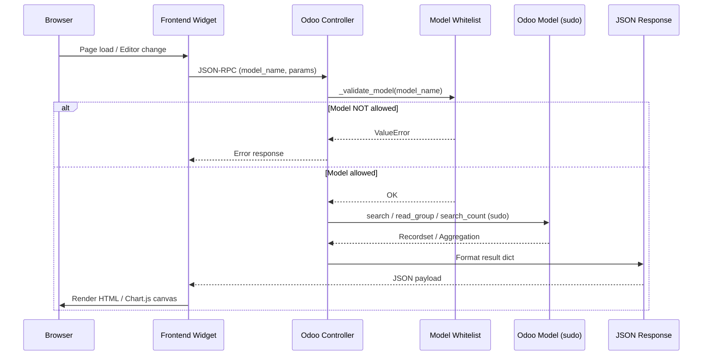
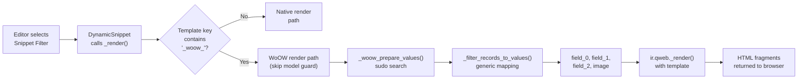
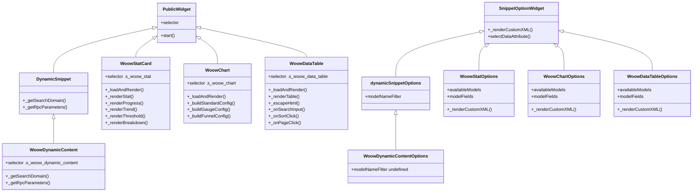
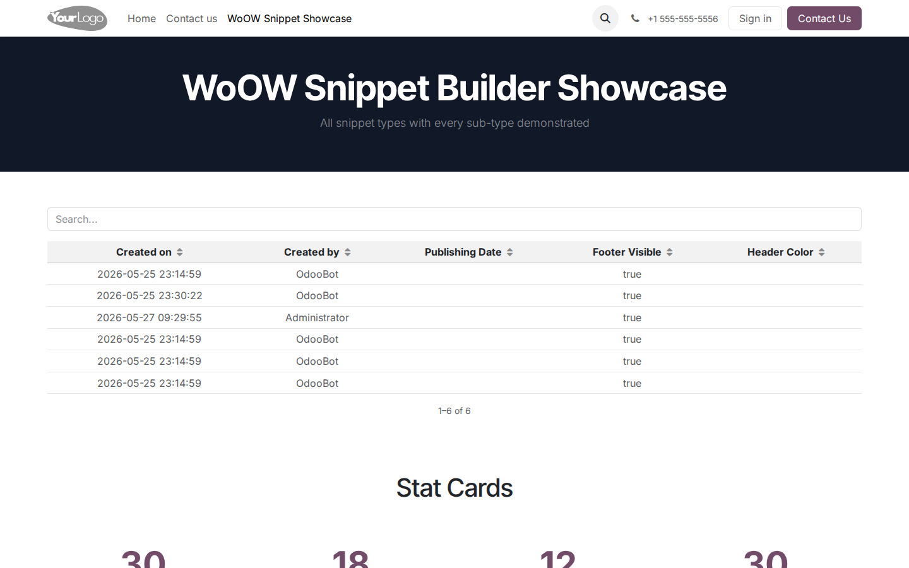
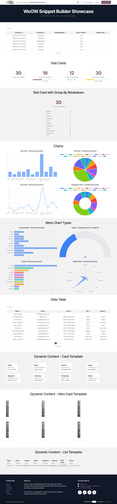

<div align="center">

<!-- Module Icon -->


# WoOW Snippet Builder

**Dynamic website snippets with native Odoo 18 editor integration**

[](https://www.odoo.com/)
[](https://developer.mozilla.org/en-US/docs/Web/JavaScript)
[](https://www.chartjs.org/)
[](https://www.python.org/)
[](https://www.gnu.org/licenses/lgpl-3.0)

*Drop four fully-configured, data-driven snippet blocks into any Odoo webpage --
no backend navigation, no custom views, no code required.*

[Overview](#overview) |
[Features](#features) |
[Architecture](#architecture) |
[Screenshots](#screenshots) |
[Installation](#installation) |
[Configuration](#configuration) |
[Security](#security) |
[API Reference](#api-reference) |
[Contributing](#contributing) |
[License](#license)

---

</div>

## Overview

**WoOW Snippet Builder** extends the Odoo 18 Website module with four drag-and-drop snippet blocks that render live data from any whitelisted Odoo model. All configuration is done inside the website editor's **BLOCKS** and **CUSTOMIZE** panels -- content editors never need to leave the page.

<p align="center">
  
</p>
<p align="center"><em>Full showcase page -- Stat Cards, Charts, Data Table, and Dynamic Content working together on a single page</em></p>

### Why This Module?

| Capability | Native Odoo Snippets | WoOW Snippet Builder |
|:-----------|:--------------------:|:--------------------:|
| Dynamic record lists | Limited to predefined models | Any of 28 whitelisted models |
| Aggregation cards (KPI) | Not available | Count, Sum, Avg, Min, Max with 4 render styles |
| Chart visualisations | Not available | 10 chart types via Chart.js |
| Paginated data tables | Not available | Searchable, sortable, paginated tables |
| QWeb display templates | One per model | 6 model-agnostic templates via generic field mapping |
| Contextual filtering | Not available | Page context and URL parameter filter modes |
| Editor integration | Native | Extends native panels -- zero learning curve |
| Backend navigation required | Sometimes | Never -- all configuration in-page |

---

## Features

### 1. Dynamic Content

Extends the native `s_dynamic_snippet` system to render records from **any** whitelisted model using model-agnostic QWeb templates.

- **6 QWeb display templates** -- Card, List, Hero Card, Compact, Table, Timeline
- **Generic field mapping** -- Templates use stable keys (`field_0`, `field_1`, `field_2`, `image`) regardless of actual model field names
- **Filter modes** -- `by_page_context` reads ancestor `data-woow-ctx-*` attributes; `by_url_param` reads `?woow_<field>=<value>` query parameters
- **Model override** -- Custom `_render()` on `website.snippet.filter` bypasses the native model-name guard for `woow_generic_mapping` templates
- **Demo data** -- Ships with 2 preconfigured snippet filters (Contacts, Companies)

<p align="center">
  
</p>
<p align="center"><em>Dynamic Content -- Card template displaying contacts from res.partner with generic field mapping</em></p>

<p align="center">
  
</p>
<p align="center"><em>Card view layout -- contact records displayed as image-backed cards with field_0 (name), field_1 (email), field_2 (city)</em></p>

<p align="center">
  
</p>
<p align="center"><em>List view layout -- same data rendered in a compact row format with inline avatars</em></p>

### 2. Stat Card

Aggregation-based KPI cards that summarise a single numeric value from any model.

- **6 operations** -- `count`, `sum`, `avg`, `min`, `max`, `count_distinct`
- **4 render styles:**
  - **Default** -- Large number with label
  - **Progress Bar** -- Value against a configurable target
  - **Trend** -- Delta and percentage change from a previous value
  - **Threshold** -- Progress bar with success / warning / danger colour coding
- **Group-by breakdown** -- Optional secondary breakdown list below the main value
- **RPC endpoint** -- `POST /woow_snippet/stat`

<p align="center">
  
</p>
<p align="center"><em>All four Stat Card styles side by side -- Default, Progress Bar, Trend, and Threshold</em></p>

<p align="center">
  
</p>
<p align="center"><em>Stat Cards demo -- aggregated KPI values pulled from Odoo models in real time</em></p>

### 3. Chart

Chart.js-powered visualisations rendered directly inside the website editor preview.

- **10 chart types** -- `bar`, `line`, `pie`, `doughnut`, `radar`, `polarArea`, `bar_horizontal`, `bar_stacked`, `gauge`, `funnel`
- **15-colour palette** -- Consistent, accessible colour scheme applied automatically
- **3 config builders** -- `_buildStandardConfig`, `_buildGaugeConfig`, `_buildFunnelConfig`
- **Multi-series support** -- Optional series field for grouped datasets
- **Gauge display** -- Half-doughnut with centre label, configurable max value
- **RPC endpoint** -- `POST /woow_snippet/chart`

<p align="center">
  
</p>
<p align="center"><em>Bar Chart and Pie Chart -- partner count grouped by country with auto-applied colour palette</em></p>

<p align="center">
  
</p>
<p align="center"><em>More chart types -- Radar and additional visualisations powered by Chart.js</em></p>

<p align="center">
  
</p>
<p align="center"><em>Chart variety -- Bar, Doughnut, Radar, and Line charts rendering live Odoo data</em></p>

### 4. Data Table

Paginated, searchable, sortable tables for displaying structured records.

- **Debounced search** -- 300 ms input debounce prevents excessive RPC calls
- **Column sorting** -- Click any header to toggle ascending / descending order
- **Pagination** -- Configurable page size (10 / 25 / 50 / 100), up to 10 page buttons displayed
- **XSS-safe** -- All cell values pass through `_escapeHtml()` before DOM insertion
- **Auto-field detection** -- Selecting a model in the editor auto-populates the first 5 fields
- **RPC endpoint** -- `POST /woow_snippet/data_table`

<p align="center">
  
</p>
<p align="center"><em>Data Table -- searchable, sortable, paginated table showing contacts (page 1 of 3, 10 per page)</em></p>

<p align="center">
  
</p>
<p align="center"><em>Data Table demo -- structured tabular view of Odoo records with sorting and search</em></p>

---

## Architecture

### Module Architecture Overview



### Request Flow



### Snippet Rendering Pipeline (Dynamic Content)



### Widget Inheritance Hierarchy



---

## File Structure

```
woow_snippet_builder/
├── __manifest__.py                          # Module metadata, version 18.0.2.0.0
├── __init__.py
│
├── controllers/
│   ├── __init__.py
│   └── main.py                              # 5 HTTP endpoints + 28-model whitelist
│
├── models/
│   ├── __init__.py
│   └── website_snippet_filter.py            # _render() / _woow_prepare_values() / _filter_records_to_values()
│
├── data/
│   ├── woow_dynamic_filter_templates.xml    # 6 QWeb templates (Card, List, Hero, Compact, Table, Timeline)
│   └── woow_snippet_filter_data.xml         # 2 demo snippet filters (Contacts, Companies)
│
├── views/
│   └── snippets/
│       ├── snippets.xml                     # BLOCKS panel: WoOW Dynamic group registration
│       ├── s_woow_dynamic_content.xml       # Dynamic Content snippet + CUSTOMIZE options
│       ├── s_woow_stat.xml                  # Stat Card snippet + CUSTOMIZE options
│       ├── s_woow_chart.xml                 # Chart snippet + CUSTOMIZE options
│       └── s_woow_data_table.xml            # Data Table snippet + CUSTOMIZE options
│
├── static/src/
│   ├── img/snippets_thumbs/                 # SVG thumbnails for the BLOCKS panel
│   │   ├── s_woow_dynamic_content.svg
│   │   ├── s_woow_stat.svg
│   │   ├── s_woow_chart.svg
│   │   └── s_woow_data_table.svg
│   │
│   └── snippets/
│       ├── s_woow_dynamic_content/
│       │   ├── 000.js                       # WoowDynamicContent (extends DynamicSnippet)
│       │   └── options.js                   # WoowDynamicContentOptions (extends dynamicSnippetOptions)
│       ├── s_woow_stat/
│       │   ├── 000.js                       # WoowStatCard (extends PublicWidget)
│       │   └── options.js                   # WoowStatOptions (extends SnippetOptionWidget)
│       ├── s_woow_chart/
│       │   ├── 000.js                       # WoowChart (extends PublicWidget)
│       │   └── options.js                   # WoowChartOptions (extends SnippetOptionWidget)
│       └── s_woow_data_table/
│           ├── 000.js                       # WoowDataTable (extends PublicWidget)
│           └── options.js                   # WoowDataTableOptions (extends SnippetOptionWidget)
│
└── docs/
    └── screenshots/                         # All screenshots referenced in this README
```

---

## Screenshots

A comprehensive visual tour of WoOW Snippet Builder -- from installation to public rendering.

### Showcase Page -- Full Overview

The showcase page demonstrates all four snippet types working together on a single Odoo webpage.

<p align="center">
  
</p>
<p align="center"><em>Full showcase page -- every snippet type rendering live data on a single page</em></p>

### Hero Section with Stat Cards

<p align="center">
  
</p>
<p align="center"><em>Hero section -- banner with all four Stat Card styles (Default, Progress, Trend, Threshold)</em></p>

<p align="center">
  
</p>
<p align="center"><em>Stat Cards close-up -- aggregated KPI values with colour-coded styles</em></p>

### Charts

<p align="center">
  
</p>
<p align="center"><em>Bar Chart and Pie Chart -- partner count by country</em></p>

<p align="center">
  
</p>
<p align="center"><em>Radar and additional chart types</em></p>

### Data Table

<p align="center">
  
</p>
<p align="center"><em>Data Table -- searchable, sortable, paginated (showing 1--10 of 30)</em></p>

### Dynamic Content

<p align="center">
  
</p>
<p align="center"><em>Dynamic Content -- Card template with contacts from res.partner</em></p>

### Public View (No Login Required)

These screenshots show the showcase page as seen by unauthenticated visitors -- all snippets render via public endpoints.

<p align="center">
  
</p>
<p align="center"><em>Public view -- top of showcase page (no login)</em></p>

<p align="center">
  
</p>
<p align="center"><em>Public view -- full showcase page accessible without authentication</em></p>

<p align="center">
  
</p>
<p align="center"><em>Public hero section with stat cards</em></p>

<p align="center">
  
</p>
<p align="center"><em>Public dynamic content section</em></p>

<p align="center">
  
</p>
<p align="center"><em>Public top section</em></p>

### Demo Page

<p align="center">
  
</p>
<p align="center"><em>Demo page -- top section with snippet blocks</em></p>

<p align="center">
  
</p>
<p align="center"><em>Demo page -- full page view</em></p>

### Backend Administration

<p align="center">
  
</p>
<p align="center"><em>Apps / Modules page -- WoOW Snippet Builder ready to install</em></p>

<p align="center">
  
</p>
<p align="center"><em>Website backend dashboard</em></p>

<p align="center">
  
</p>
<p align="center"><em>Website pages list -- showcase and demo pages</em></p>

<p align="center">
  
</p>
<p align="center"><em>Snippet Filter records -- preconfigured Contacts and Companies filters</em></p>

<p align="center">
  
</p>
<p align="center"><em>Website frontend overview</em></p>

---

## Installation

### Prerequisites

- **Odoo 18.0** (Community or Enterprise)
- **Python 3.10+**
- **`website` module** installed and enabled

### Steps

1. **Clone the repository** into your Odoo addons path:

   ```bash
   git clone https://github.com/nicetag/Woow_odoo_saas_management.git
   ```

2. **Copy the module** to your addons directory:

   ```bash
   cp -r Woow_odoo_saas_management/woow_snippet_builder /path/to/odoo/addons/
   ```

3. **Restart the Odoo service:**

   ```bash
   sudo systemctl restart odoo
   ```

4. **Update the Apps List** -- navigate to **Apps**, click **Update Apps List**.

5. **Install** -- search for `WoOW Snippet Builder` and click **Install**.

   Or via CLI:

   ```bash
   odoo -d <dbname> -i woow_snippet_builder --stop-after-init
   ```

<p align="center">
  
</p>
<p align="center"><em>Find and install WoOW Snippet Builder from the Odoo Apps page</em></p>

> **Note:** The module depends only on `website`. No additional Python packages or external libraries are required -- Chart.js is bundled with Odoo's web assets.

---

## Configuration

All snippet configuration is performed inside the Odoo 18 Website Editor. No backend menus or settings pages are involved.

### Step 1 -- Open the Website Editor

Navigate to your website and click **Edit** in the top bar.

### Step 2 -- Add a WoOW Snippet

In the **BLOCKS** panel on the left, scroll to the **WoOW Dynamic** group. Drag one of the four snippet types onto the page:

| Snippet | Description |
|:--------|:------------|
| **Dynamic Content** | Record list using QWeb templates |
| **Stat Card** | Aggregated KPI number |
| **Chart** | Chart.js visualisation |
| **Data Table** | Paginated data grid |

### Step 3 -- Configure in the CUSTOMIZE Panel

Click the snippet on the page to open the **CUSTOMIZE** panel on the right. Each snippet type exposes its own options:

#### Dynamic Content

| Option | Description |
|:-------|:------------|
| **Filter** | Select a `website.snippet.filter` record (ships with Contacts and Companies) |
| **Template** | Choose from 6 QWeb templates (Card, List, Hero Card, Compact, Table, Timeline) |
| **Number of Records** | Limit how many records to display |

<p align="center">
  
</p>
<p align="center"><em>Dynamic Content configured with the Card template -- contacts rendered via generic field mapping</em></p>

#### Stat Card

| Option | Description |
|:-------|:------------|
| **Model** | Select from 28 whitelisted models |
| **Operation** | `Count`, `Sum`, `Average`, `Min`, `Max`, `Count Distinct` |
| **Field** | Numeric field for aggregation (not needed for Count) |
| **Group By** | Optional breakdown field |
| **Style** | `Default`, `Progress Bar`, `Trend`, `Threshold` |
| **Target Value** | Target for progress bar / threshold styles |
| **Previous Value** | Comparison value for trend style |
| **Domain** | Optional Odoo domain filter, e.g. `[('active','=',True)]` |

<p align="center">
  
</p>
<p align="center"><em>Stat Card styles -- Default, Progress Bar, Trend, and Threshold with live data</em></p>

#### Chart

| Option | Description |
|:-------|:------------|
| **Model** | Select from 28 whitelisted models |
| **Chart Type** | `Bar`, `Line`, `Pie`, `Doughnut`, `Radar`, `Polar Area`, `Horizontal Bar`, `Stacked Bar`, `Gauge`, `Funnel` |
| **Label Field** | Categorical field for X-axis / slices |
| **Value Field** | Numeric field for Y-axis / values |
| **Series Field** | Optional second grouping for multi-series charts |
| **Gauge Max** | Maximum value for gauge chart type |
| **Domain** | Optional Odoo domain filter |

<p align="center">
  
</p>
<p align="center"><em>Chart configured as Bar + Pie -- partner count by country</em></p>

#### Data Table

| Option | Description |
|:-------|:------------|
| **Model** | Select from 28 whitelisted models |
| **Fields** | Comma-separated field names (auto-populated with first 5 on model change) |
| **Page Size** | `10`, `25`, `50`, or `100` rows per page |
| **Searchable** | Enable / disable the search bar |
| **Sortable** | Enable / disable column header sorting |
| **Domain** | Optional Odoo domain filter |

<p align="center">
  
</p>
<p align="center"><em>Data Table configured for res.partner -- search, sort, and paginate through records</em></p>

### Step 4 -- Save and Publish

Click **Save** in the editor toolbar. The snippets will render live data on the published page.

### Snippet Filter Records (Backend)

The Dynamic Content snippet relies on `website.snippet.filter` records. Two are shipped by default:

<p align="center">
  
</p>
<p align="center"><em>Snippet Filter records in the backend -- Contacts and Companies are preconfigured</em></p>

---

## Security

### Model Whitelist

All public-facing endpoints enforce a **28-model whitelist** defined in `_DEFAULT_ALLOWED_MODELS`:

```
res.partner         res.company          res.users
product.template    product.product      sale.order
sale.order.line     purchase.order       purchase.order.line
account.move        account.move.line    stock.picking
stock.move          project.project      project.task
hr.employee         hr.department        crm.lead
helpdesk.ticket     event.event          event.registration
survey.survey       survey.user_input    fleet.vehicle
maintenance.request lunch.order          website.page
blog.post
```

Any request targeting a model outside this list is rejected with a `ValueError` before any data access occurs.

### Extending the Whitelist

To add custom models, override `_get_allowed_models()` on the controller:

```python
from odoo.addons.woow_snippet_builder.controllers.main import WoowSnippetController

class CustomSnippetController(WoowSnippetController):

    def _get_allowed_models(self):
        allowed = super()._get_allowed_models()
        allowed.add('my_module.my_model')
        return allowed
```

### Access Control

| Layer | Mechanism |
|:------|:----------|
| **Whitelist** | `_validate_model()` checks model name against `_DEFAULT_ALLOWED_MODELS` |
| **sudo()** | Public endpoints use `sudo()` to bypass ACL -- whitelist is the access gate |
| **Editor endpoints** | `/woow_snippet/available_models` and `/woow_snippet/model_fields` require `auth='user'` |
| **XSS prevention** | Data Table widget escapes all cell values via `_escapeHtml()` (`&`, `<`, `>`, `"`) |
| **Domain parsing** | `safe_eval()` with restricted globals prevents injection via domain strings |

---

## API Reference

All endpoints use Odoo's JSON-RPC protocol (`type='json'`). Send requests as `POST` with `Content-Type: application/json` and the standard `jsonrpc: "2.0"` wrapper.

### GET Available Models

```
POST /woow_snippet/available_models
Auth: user (session required)
```

Returns the list of whitelisted models with human-readable names.

**Response:**

```json
[
    {"model": "res.partner", "name": "Contact"},
    {"model": "sale.order", "name": "Sales Order"}
]
```

<p align="center">
  
</p>
<p align="center"><em>API response -- /woow_snippet/models returns all 28 whitelisted models with display names</em></p>

---

### GET Model Fields

```
POST /woow_snippet/model_fields
Auth: user (session required)
```

**Parameters:**

| Parameter | Type | Required | Description |
|:----------|:-----|:---------|:------------|
| `model_name` | `string` | Yes | Technical model name (e.g. `res.partner`) |

**Response:**

```json
[
    {"name": "name", "string": "Name", "type": "char"},
    {"name": "email", "string": "Email", "type": "char"},
    {"name": "credit_limit", "string": "Credit Limit", "type": "float"}
]
```

> Excludes `one2many`, `binary`, `serialized`, `properties`, and `properties_definition` fields. Only stored fields are returned.

<p align="center">
  
</p>
<p align="center"><em>API response -- /woow_snippet/fields for res.partner shows field names, labels, and types</em></p>

---

### POST Stat Data

```
POST /woow_snippet/stat
Auth: public
```

Returns aggregated stat data for the Stat Card snippet.

**Parameters:**

| Parameter | Type | Default | Description |
|:----------|:-----|:--------|:------------|
| `model_name` | `string` | -- | Technical model name |
| `operation` | `string` | `count` | One of: `count`, `sum`, `avg`, `min`, `max`, `count_distinct` |
| `field_name` | `string` | `""` | Numeric field for aggregation |
| `group_by` | `string` | `""` | Optional breakdown field |
| `domain` | `string` | `"[]"` | Odoo domain as string |
| `sub_type` | `string` | `default` | Render style: `default`, `progress`, `trend`, `threshold` |
| `target_value` | `float` | `100` | Target for progress / threshold |
| `threshold_warning` | `float` | `50` | Warning threshold percentage |
| `threshold_danger` | `float` | `25` | Danger threshold percentage |
| `previous_value` | `float` | `0` | Previous value for trend delta |

**Response (default):**

```json
{
    "value": 42,
    "sub_type": "default",
    "breakdown": []
}
```

**Response (progress):**

```json
{
    "value": 42,
    "sub_type": "progress",
    "target": 100,
    "percent": 42.0,
    "breakdown": []
}
```

**Response (trend):**

```json
{
    "value": 42,
    "sub_type": "trend",
    "delta": 7,
    "delta_percent": 20.0,
    "breakdown": []
}
```

**Response (threshold):**

```json
{
    "value": 42,
    "sub_type": "threshold",
    "target": 100,
    "percent": 42.0,
    "status": "warning",
    "breakdown": []
}
```

---

### POST Chart Data

```
POST /woow_snippet/chart
Auth: public
```

Returns aggregated chart data for the Chart snippet.

**Parameters:**

| Parameter | Type | Default | Description |
|:----------|:-----|:--------|:------------|
| `model_name` | `string` | -- | Technical model name |
| `chart_type` | `string` | `bar` | One of: `bar`, `line`, `pie`, `doughnut`, `radar`, `polarArea`, `bar_horizontal`, `bar_stacked`, `gauge`, `funnel` |
| `label_field` | `string` | `""` | Categorical field for grouping |
| `value_field` | `string` | `""` | Numeric field for values (use `id` or `__count` for record count) |
| `domain` | `string` | `"[]"` | Odoo domain as string |
| `gauge_max` | `float` | `100` | Maximum value for gauge type |
| `series_field` | `string` | `""` | Optional second grouping for multi-series |

**Response (single series):**

```json
{
    "labels": ["Won", "Lost", "New"],
    "datasets": [
        {"label": "expected_revenue", "data": [50000, 12000, 34000]}
    ],
    "chart_type": "bar",
    "gauge_max": 100
}
```

**Response (multi-series):**

```json
{
    "labels": ["Q1", "Q2", "Q3"],
    "datasets": [
        {"label": "Sales Team A", "data": [10000, 15000, 12000]},
        {"label": "Sales Team B", "data": [8000, 11000, 14000]}
    ],
    "chart_type": "bar",
    "gauge_max": 100
}
```

---

### POST Data Table

```
POST /woow_snippet/data_table
Auth: public
```

Returns paginated table data for the Data Table snippet.

**Parameters:**

| Parameter | Type | Default | Description |
|:----------|:-----|:--------|:------------|
| `model_name` | `string` | -- | Technical model name |
| `field_names` | `string` | `""` | Comma-separated field names |
| `domain` | `string` | `"[]"` | Odoo domain as string |
| `offset` | `int` | `0` | Pagination offset |
| `limit` | `int` | `25` | Page size (clamped to 1--100) |
| `sort_field` | `string` | `""` | Field to sort by |
| `sort_order` | `string` | `asc` | `asc` or `desc` |
| `search_term` | `string` | `""` | Free-text search across char/text fields |

**Response:**

```json
{
    "columns": [
        {"name": "name", "string": "Name", "type": "char"},
        {"name": "email", "string": "Email", "type": "char"},
        {"name": "city", "string": "City", "type": "char"}
    ],
    "rows": [
        {"id": 1, "name": "Acme Corp", "email": "info@acme.com", "city": "New York"},
        {"id": 2, "name": "Globex", "email": "hello@globex.com", "city": "London"}
    ],
    "total": 128,
    "offset": 0,
    "limit": 25
}
```

---

## QWeb Display Templates

The Dynamic Content snippet ships with 6 model-agnostic QWeb templates:

| Template | XML ID | Layout | Columns |
|:---------|:-------|:-------|:--------|
| **Card** | `dynamic_filter_template_woow_card` | Image + title + subtitle + detail | 4 per row |
| **List** | `dynamic_filter_template_woow_list` | Inline row with avatar | 1 per row |
| **Hero Card** | `dynamic_filter_template_woow_hero` | Full-bleed image with gradient overlay | 3 per row |
| **Compact** | `dynamic_filter_template_woow_compact` | Minimal row with avatar | 1 per row |
| **Table** | `dynamic_filter_template_woow_table` | Three-column tabular row | 1 per row |
| **Timeline** | `dynamic_filter_template_woow_timeline` | Numbered steps with connector | 1 per row |

All templates consume these generic keys:

| Key | Source | Description |
|:----|:-------|:------------|
| `field_0` | First non-binary field in filter | Primary display value (e.g. name) |
| `field_1` | Second non-binary field | Secondary value (e.g. email) |
| `field_2` | Third non-binary field | Tertiary value (e.g. city) |
| `image` | First binary/image field | Image URL via `/web/image/...` |
| `display_name` | `record.display_name` | Record display name |
| `call_to_action_url` | `record.website_url` or `#` | Link target |

---

## JavaScript Widgets Reference

### Frontend Widgets (`web.assets_frontend`)

| Widget | File | Selector | Base Class |
|:-------|:-----|:---------|:-----------|
| `WoowDynamicContent` | `s_woow_dynamic_content/000.js` | `.s_woow_dynamic_content` | `DynamicSnippet` |
| `WoowStatCard` | `s_woow_stat/000.js` | `.s_woow_stat` | `PublicWidget` |
| `WoowChart` | `s_woow_chart/000.js` | `.s_woow_chart` | `PublicWidget` |
| `WoowDataTable` | `s_woow_data_table/000.js` | `.s_woow_data_table` | `PublicWidget` |

### Editor Option Widgets (`website.assets_wysiwyg`)

| Widget | File | Base Class |
|:-------|:-----|:-----------|
| `WoowDynamicContentOptions` | `s_woow_dynamic_content/options.js` | `dynamicSnippetOptions` |
| `WoowStatOptions` | `s_woow_stat/options.js` | `options.Class` (SnippetOptionWidget) |
| `WoowChartOptions` | `s_woow_chart/options.js` | `options.Class` (SnippetOptionWidget) |
| `WoowDataTableOptions` | `s_woow_data_table/options.js` | `options.Class` (SnippetOptionWidget) |

---

## Contributing

Contributions are welcome. Please follow these guidelines:

1. **Fork** the repository and create a feature branch from `main`.
2. **Follow Odoo coding standards** -- PEP 8 for Python, Odoo module conventions for XML and JS.
3. **Test** your changes against a clean Odoo 18 database.
4. **Document** any new endpoints, options, or configuration parameters.
5. Submit a **Pull Request** with a clear description of the changes.

### Development Tips

- Enable **Developer Mode** (`?debug=1`) to inspect `data-*` attributes on snippet elements.
- Use the browser console to monitor JSON-RPC calls to `/woow_snippet/*` endpoints.
- Override `_get_allowed_models()` in a separate module to add models without modifying this one.
- The `woow_generic_mapping` context flag controls whether `_filter_records_to_values()` uses generic key mapping.

---

## License

This module is licensed under the [GNU Lesser General Public License v3.0 (LGPL-3)](https://www.gnu.org/licenses/lgpl-3.0.html).

```
Copyright (C) WoOW Technology - https://woowtech.com
License LGPL-3.0 or later (https://www.gnu.org/licenses/lgpl-3.0.html)
```

---

## Links

| Resource | URL |
|:---------|:----|
| WoOW Technology | [https://woowtech.com](https://woowtech.com) |
| Odoo 18 Documentation | [https://www.odoo.com/documentation/18.0/](https://www.odoo.com/documentation/18.0/) |
| Chart.js Documentation | [https://www.chartjs.org/docs/latest/](https://www.chartjs.org/docs/latest/) |

---

<div align="center">

**[Chinese README / 中文說明](README_zh-TW.md)**

---

<sub>Built with care by <a href="https://woowtech.com">WoOW Technology</a></sub>

</div>
