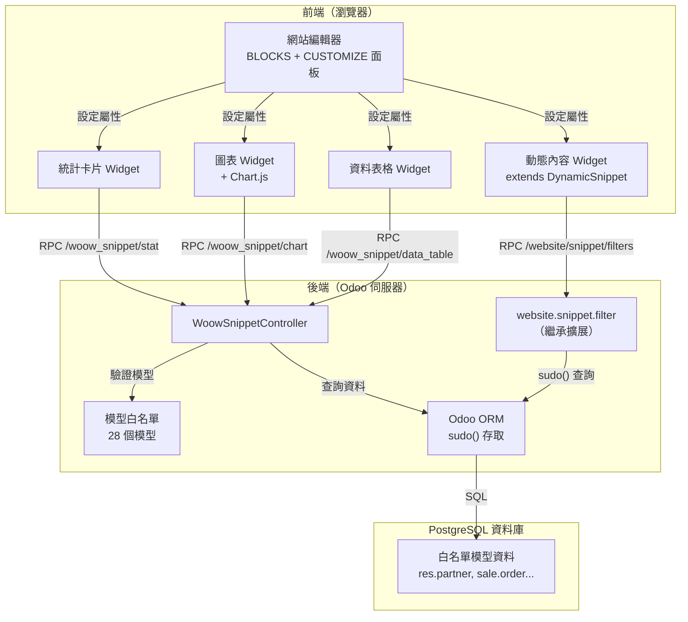
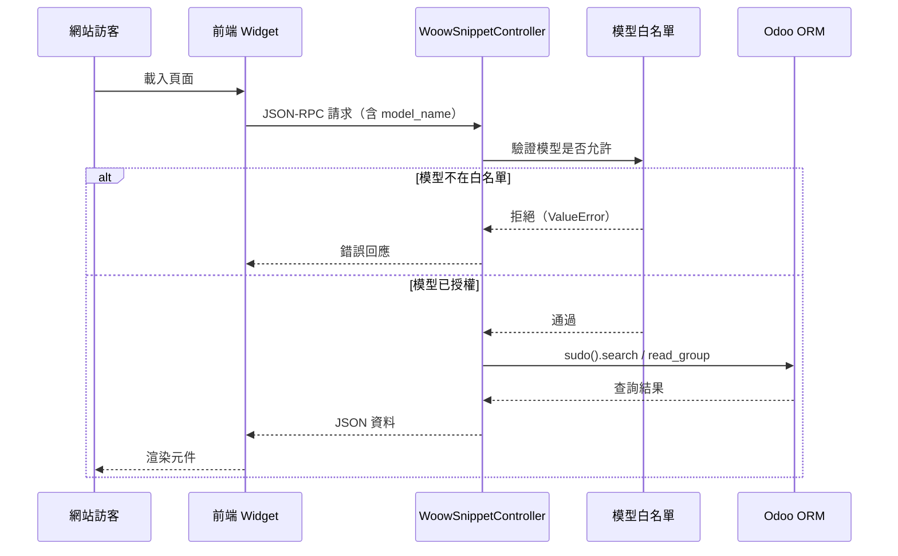
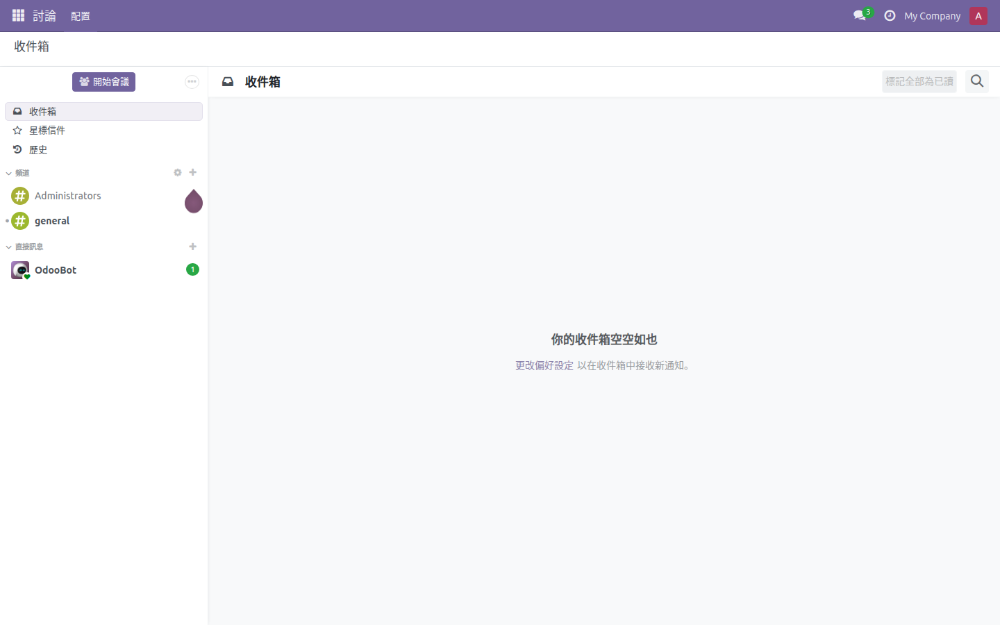
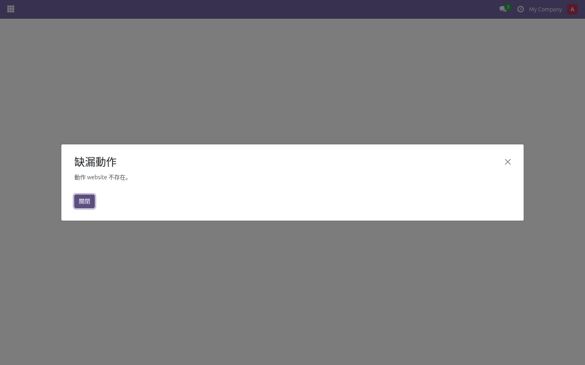
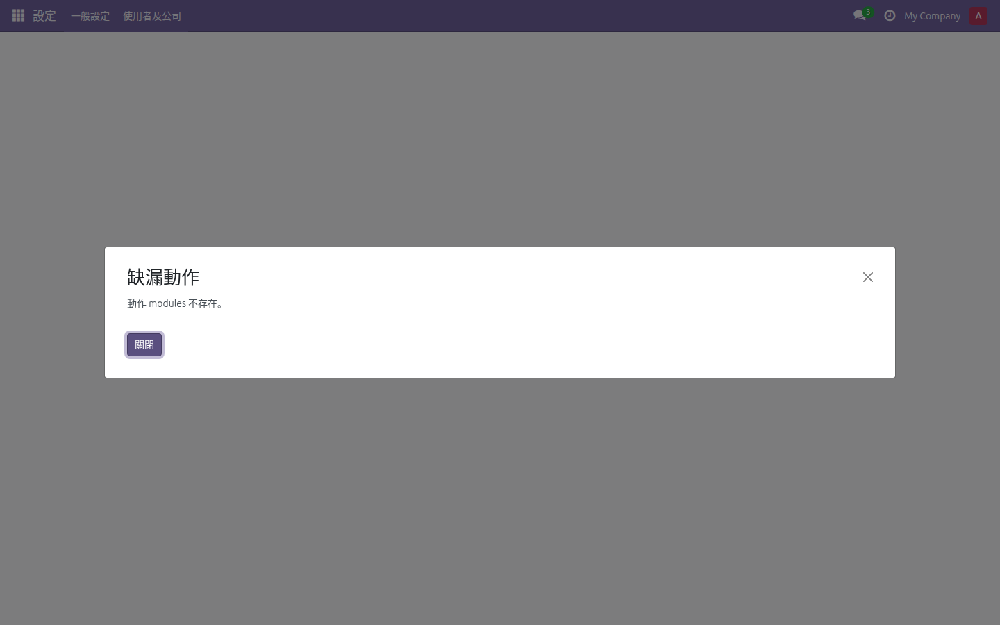
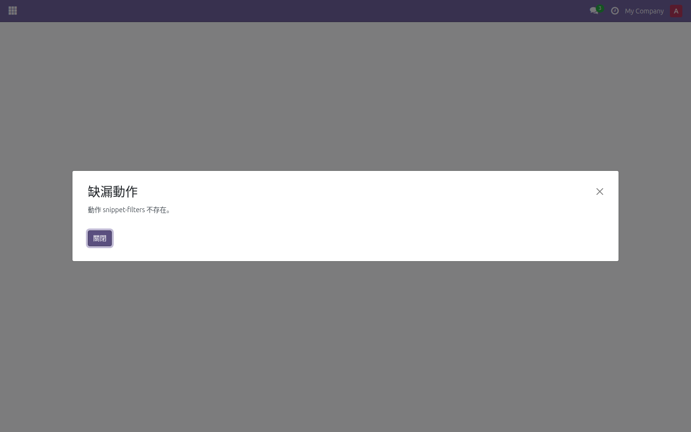
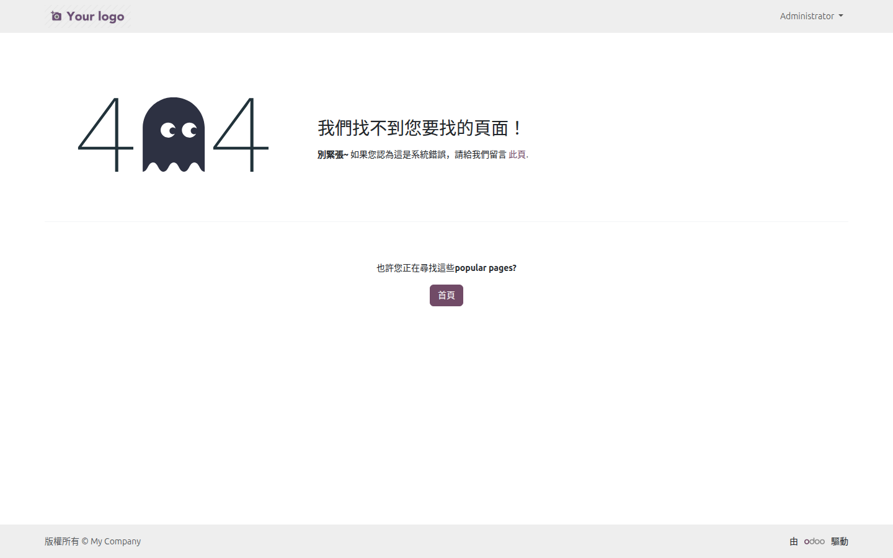

<div align="center">

# WoOW 網站元件建構器

### woow_snippet_builder

[](https://www.odoo.com)
[](https://www.gnu.org/licenses/lgpl-3.0)
[]()
[]()
[](https://woowtech.com)

**在 Odoo 18 網站編輯器中，用拖放的方式建立動態數據元件 — 完全不需要寫程式。**

[English](README.md) | **繁體中文**

</div>

---

## 導航

- [概述](#概述)
- [為什麼選擇此模組？](#為什麼選擇此模組)
- [功能特色](#功能特色)
- [系統架構](#系統架構)
- [檔案結構](#檔案結構)
- [功能截圖](#功能截圖)
- [安裝說明](#安裝說明)
- [設定指南](#設定指南)
- [安全機制](#安全機制)
- [API 參考](#api-參考)
- [授權條款](#授權條款)

---

## 概述

WoOW Snippet Builder 為 Odoo 18 網站提供 **4 種動態資料元件**，完美整合至網站編輯器的 BLOCKS（區塊）和 CUSTOMIZE（自訂）面板。網站編輯者可以直接在視覺化編輯器中拖放元件、選擇資料來源、調整顯示方式 — 全部透過圖形介面操作，完全不需要進入後台或撰寫任何程式碼。

模組的設計理念是「零後台操作」：所有元件的設定、資料對接、樣式切換，都在網站編輯器的右側面板完成。資料透過 JSON-RPC 端點即時載入，由控制器層的模型白名單確保安全性。

---

## 為什麼選擇此模組？

| 比較項目 | 傳統做法 | WoOW Snippet Builder |
|----------|----------|---------------------|
| 在網站顯示 ERP 數據 | 需要開發客製報表 | 拖放元件即完成 |
| 修改顯示的資料 | 修改程式碼後重啟服務 | 在 CUSTOMIZE 面板切換選項 |
| 圖表視覺化 | 安裝第三方圖表模組 + 設定 | 內建 10 種圖表類型，選好就顯示 |
| 資料表格 | 開發 Controller + 模板 | 選模型 + 欄位，自動支援搜尋排序分頁 |
| 技術門檻 | 需要 Python/JS 開發經驗 | 網站編輯者即可操作 |
| 安全性 | 需自行處理權限 | 內建 28 個模型白名單 + XSS 防護 |
| 依賴項目 | 各種第三方模組 | 僅依賴 `website` 模組 |

---

## 功能特色

### 1. 動態內容（Dynamic Content）

擴展 Odoo 原生的 `s_dynamic_snippet` 系統，提供通用欄位映射機制，讓單一組 QWeb 模板能渲染任何模型的記錄。

**6 種版型模板：**

| 版型 | 說明 | 適合場景 |
|------|------|----------|
| **Card（卡片）** | 帶封面圖的方形卡片，每列 4 張 | 產品展示、團隊成員 |
| **List（清單）** | 左側圓形頭像 + 三行文字 | 聯絡人清單、簡潔列表 |
| **Hero Card（大圖卡片）** | 200px 封面圖 + 漸層遮罩文字 | 精選文章、活動焦點 |
| **Compact（精簡）** | 小圓頭像 + 堆疊標題副標 | 側邊欄、小空間 |
| **Table（表格）** | 三欄式平面表格 | 排行榜、簡單數據列表 |
| **Timeline（時間軸）** | 編號圓形 + 垂直排列的內容 | 歷程記錄、步驟說明 |

**核心特性：**
- 通用欄位映射：`field_0`、`field_1`、`field_2`、`image`
- 支援 `by_page_context` 過濾模式 — 讀取祖先元素的 `data-woow-ctx-*` 屬性
- 支援 `by_url_param` 過濾模式 — 讀取網址列 `woow_` 前綴參數
- 整合原生 Filter（過濾器）系統，相容現有的 `website.snippet.filter` 記錄

---

### 2. 統計卡片（Stat Card）

聚合統計卡片，從任何白名單模型中計算數據並以醒目方式呈現。

**支援運算：**
- `count` — 計算記錄筆數
- `sum` — 欄位值加總
- `avg` — 欄位值平均
- `min` — 欄位最小值
- `max` — 欄位最大值
- `count_distinct` — 不重複值計數

**4 種渲染樣式：**

| 樣式 | 視覺效果 | 額外設定 |
|------|----------|----------|
| **Default（預設）** | 大數字 + 標籤文字 | 無 |
| **Progress（進度條）** | 大數字 + Bootstrap 進度條 + 百分比 | 需設定目標值 |
| **Trend（趨勢）** | 大數字 + 方向箭頭 + 變化量/百分比 | 需設定前期值 |
| **Threshold（閾值）** | 大數字 + 會變色的進度條（綠/黃/紅） | 需設定目標值和閾值 |

**其他特性：**
- 支援 Group By 分組，顯示明細列表
- RPC 端點：`/woow_snippet/stat`

---

### 3. 圖表（Chart）

整合 Chart.js 函式庫（使用 Odoo 內建版本，無外部 CDN 呼叫），提供完整的數據視覺化能力。

**10 種圖表類型：**

| 圖表類型 | 設定值 | 說明 |
|----------|--------|------|
| 長條圖 | `bar` | 垂直長條比較 |
| 折線圖 | `line` | 時間趨勢分析 |
| 圓餅圖 | `pie` | 佔比分析 |
| 甜甜圈圖 | `doughnut` | 現代佔比呈現 |
| 雷達圖 | `radar` | 多維度比較 |
| 極座標面積圖 | `polarArea` | 放射狀比較 |
| 水平長條圖 | `bar_horizontal` | 長名稱分類比較 |
| 堆疊長條圖 | `bar_stacked` | 分類 + 組成分析 |
| 儀表板 | `gauge` | 單一 KPI 達標顯示 |
| 漏斗圖 | `funnel` | 轉換流程視覺化 |

**其他特性：**
- 15 色調色盤，自動分配色彩
- 3 個配置建構器：標準圖表、儀表板、漏斗
- 支援多系列（Series Field）分組
- RPC 端點：`/woow_snippet/chart`

---

### 4. 資料表格（Data Table）

可分頁、可搜尋、可排序的動態資料表格，直接呈現模型記錄。

**核心功能：**
- **伺服器端搜尋** — 跨 char/text/html 欄位的 OR 模糊比對
- **防抖搜尋** — 300ms 延遲，避免連續按鍵觸發大量請求
- **欄位排序** — 點擊欄位標題切換升序/降序
- **分頁瀏覽** — 最多顯示 10 個頁碼，每頁 1~100 筆可調
- **XSS 防護** — 所有輸出值經過 HTML 轉義處理
- **自動填充** — 切換模型時自動帶入前 5 個欄位名稱

**RPC 端點：** `/woow_snippet/data_table`

---

## 系統架構





---

## 檔案結構

```
woow_snippet_builder/
├── __init__.py                          # 匯入 controllers 和 models
├── __manifest__.py                      # 模組中繼資料、依賴、資源宣告
├── controllers/
│   ├── __init__.py                      # 匯入 main
│   └── main.py                          # 5 個 RPC 路由、模型白名單、Domain 解析
├── models/
│   ├── __init__.py                      # 匯入 website_snippet_filter
│   └── website_snippet_filter.py        # 繼承 website.snippet.filter，通用欄位映射
├── data/
│   ├── woow_snippet_filter_data.xml     # 預設 Filter 資料（Contacts + Companies）
│   └── woow_dynamic_filter_templates.xml # 6 個 QWeb 版型模板
├── views/
│   └── snippets/
│       ├── snippets.xml                 # 註冊「WoOW Dynamic」群組 + 4 個元件
│       ├── s_woow_dynamic_content.xml   # 動態內容：HTML 結構 + CUSTOMIZE 選項
│       ├── s_woow_stat.xml              # 統計卡片：HTML 結構 + CUSTOMIZE 選項
│       ├── s_woow_chart.xml             # 圖表：HTML 結構 + CUSTOMIZE 選項
│       └── s_woow_data_table.xml        # 資料表格：HTML 結構 + CUSTOMIZE 選項
├── static/
│   └── src/
│       ├── img/snippets_thumbs/
│       │   ├── s_woow_chart.svg         # 圖表縮圖
│       │   ├── s_woow_data_table.svg    # 資料表格縮圖
│       │   ├── s_woow_dynamic_content.svg # 動態內容縮圖
│       │   └── s_woow_stat.svg          # 統計卡片縮圖
│       └── snippets/
│           ├── s_woow_dynamic_content/
│           │   ├── 000.js               # 前端 Widget（擴展 DynamicSnippet）
│           │   └── options.js           # 編輯器選項
│           ├── s_woow_stat/
│           │   ├── 000.js               # 前端 Widget（4 種樣式渲染）
│           │   └── options.js           # 編輯器選項（模型/欄位動態載入）
│           ├── s_woow_chart/
│           │   ├── 000.js               # 前端 Widget（Chart.js 整合）
│           │   └── options.js           # 編輯器選項（圖表類型/欄位選擇）
│           └── s_woow_data_table/
│               ├── 000.js               # 前端 Widget（分頁/搜尋/排序）
│               └── options.js           # 編輯器選項（自動填充欄位）
└── docs/
    ├── LLM_KNOWLEDGE_BASE.md            # 技術知識庫
    └── MANUAL_zh-TW.md                  # 中文使用教學手冊
```

---

## 功能截圖

### 前台網站呈現

<div align="center">



*元件在前台網站頁面的實際呈現效果*

</div>

### 後台網站編輯器

<div align="center">



*在網站編輯器中透過 CUSTOMIZE 面板設定元件*

</div>

### 模組安裝畫面

<div align="center">



*在 Odoo 應用程式列表中搜尋安裝模組*

</div>

### Filter 清單

<div align="center">



*Dynamic Content 元件使用的 Filter 過濾器清單*

</div>

### API 回傳：可用模型

<div align="center">



*`/woow_snippet/available_models` 端點回傳的白名單模型*

</div>

### API 回傳：模型欄位

<div align="center">


*`/woow_snippet/model_fields` 端點回傳的 res.partner 欄位資訊*

</div>

### 網站頁面列表

<div align="center">


*放置了 WoOW 元件的網站頁面列表*

</div>

---

## 安裝說明

### 系統需求

- **Odoo 版本：** 18.0
- **必要依賴：** `website` 模組（Odoo 網站 App）
- **其他：** 無額外依賴。白名單中的其他模組（如 sale、hr）為選用——若未安裝，對應模型不會出現在下拉選單中。

### 安裝步驟

**1. 放置模組**

將 `woow_snippet_builder` 資料夾放入 Odoo 的 addons 路徑：

```bash
# 例如放在自訂 addons 路徑下
cp -r woow_snippet_builder /path/to/odoo/custom-addons/
```

**2. 更新模組列表**

```bash
# 方法一：命令列
./odoo-bin -d <your_database> --update=base --stop-after-init

# 方法二：在 Odoo 後台
# 設定 → 啟用開發者模式 → 應用程式 → 更新模組列表
```

**3. 安裝模組**

```bash
# 方法一：命令列
./odoo-bin -d <your_database> -i woow_snippet_builder

# 方法二：在 Odoo 後台
# 應用程式 → 搜尋「WoOW Snippet」→ 點擊「安裝」
```

**4. 驗證安裝**

1. 進入前台網站
2. 點擊「編輯」進入網站編輯器
3. 在左側 BLOCKS 面板中確認有「WoOW Dynamic」群組
4. 群組中應有 4 個元件：Dynamic Content、Stat Card、Chart、Data Table

### 升級模組

```bash
./odoo-bin -d <your_database> -u woow_snippet_builder
```

> **注意：** 升級不會影響已放置在頁面上的元件及其設定。所有設定儲存在 HTML 的 `data-*` 屬性中，升級僅更新程式碼和模板。

---

## 設定指南

### 操作流程

所有元件的設定都在網站編輯器中完成，不需要進入 Odoo 後台：

1. **進入編輯器** — 前往網站頁面，點擊右上角「編輯」
2. **拖放元件** — 從左側 BLOCKS 面板的「WoOW Dynamic」群組拖放元件到頁面
3. **設定資料** — 點選元件後，在右側 CUSTOMIZE 面板中設定資料來源和顯示方式
4. **儲存頁面** — 點擊右上角「儲存」

### 各元件設定說明

#### 統計卡片（Stat Card）

| 設定項目 | 必填 | 說明 |
|----------|------|------|
| Model（模型）| 是 | 選擇要查詢的資料模型 |
| Operation（運算）| 是 | count / sum / avg / min / max |
| Field（欄位）| sum/avg/min/max 時需要 | 要聚合的數字欄位 |
| Group By（分組）| 否 | 按欄位分組顯示明細 |
| Style（樣式）| 否 | default / progress / trend / threshold |
| Target Value | progress/threshold 時需要 | 目標值 |
| Previous Value | trend 時需要 | 前期比較值 |
| Domain（條件）| 否 | Odoo Domain 過濾語法 |

#### 圖表（Chart）

| 設定項目 | 必填 | 說明 |
|----------|------|------|
| Model（模型）| 是 | 選擇要查詢的資料模型 |
| Chart Type（圖表類型）| 是 | 10 種圖表類型 |
| Label Field（標籤欄位）| 是 | X 軸分類欄位 |
| Value Field（數值欄位）| 是 | Y 軸數值欄位 |
| Series Field（系列欄位）| 否 | 多系列分組欄位 |
| Gauge Max | gauge 類型時需要 | 儀表板最大值 |
| Domain（條件）| 否 | Odoo Domain 過濾語法 |

#### 資料表格（Data Table）

| 設定項目 | 必填 | 說明 |
|----------|------|------|
| Model（模型）| 是 | 選擇要查詢的資料模型 |
| Fields（欄位）| 是 | 逗號分隔的技術欄位名稱 |
| Page Size（每頁筆數）| 否 | 10 / 25 / 50 / 100 |
| Searchable（可搜尋）| 否 | 是否顯示搜尋框 |
| Sortable（可排序）| 否 | 是否啟用欄位排序 |
| Domain（條件）| 否 | Odoo Domain 過濾語法 |

#### 動態內容（Dynamic Content）

| 設定項目 | 必填 | 說明 |
|----------|------|------|
| Filter（過濾器）| 是 | 選擇資料來源 Filter |
| Template（版型）| 是 | 選擇 6 種版型之一 |

> **提示：** Dynamic Content 使用 Odoo 原生的 Filter 機制。模組安裝後預設提供「Contacts」和「Companies」兩個 Filter。若需查詢其他模型，可在後台「技術 → 網站 → 片段過濾器」中新增。

### Domain 過濾語法

所有支援 Domain 的元件都使用 Odoo 標準過濾語法：

```python
# 基本格式
[('欄位名稱', '運算子', '值')]

# 常用範例
[('state', '=', 'sale')]                    # 已確認的銷售訂單
[('city', 'ilike', 'Taipei')]               # 城市包含 Taipei
[('amount_total', '>', 10000)]              # 金額大於 10000
[('create_date', '>=', '2024-01-01')]       # 2024 年後建立
[('state', 'in', ['sale', 'done'])]         # 狀態為已確認或已完成
[]                                           # 不過濾（查全部）
```

---

## 安全機制

### 模型白名單

模組內建 **28 個允許查詢的模型**，定義在 `_DEFAULT_ALLOWED_MODELS` 中：

| 類別 | 模型 |
|------|------|
| **基礎** | `res.partner`、`res.company`、`res.users` |
| **銷售** | `sale.order`、`sale.order.line` |
| **產品** | `product.template`、`product.product` |
| **採購** | `purchase.order`、`purchase.order.line` |
| **會計** | `account.move`、`account.move.line` |
| **庫存** | `stock.picking`、`stock.move` |
| **專案** | `project.project`、`project.task` |
| **人資** | `hr.employee`、`hr.department` |
| **CRM** | `crm.lead` |
| **客服** | `helpdesk.ticket` |
| **活動** | `event.event`、`event.registration` |
| **問卷** | `survey.survey`、`survey.user_input` |
| **其他** | `fleet.vehicle`、`maintenance.request`、`lunch.order`、`website.page`、`blog.post` |

### 安全設計決策

| 安全層面 | 實作方式 |
|----------|----------|
| **模型存取控制** | 白名單機制 — 僅白名單內的模型可透過公開端點查詢 |
| **資料讀取** | 使用 `sudo()` 繞過 ACL，但受白名單約束 |
| **Domain 解析** | 使用 `safe_eval` 搭配限制性全域變數（僅允許 True/False/None） |
| **XSS 防護** | Data Table 的 `_escapeHtml()` 方法將 `&`、`<`、`>`、`"` 轉義為 HTML 實體 |
| **端點分離** | 編輯器端點 `auth='user'`（需登入）；資料端點 `auth='public'` + `readonly=True` |
| **擴展機制** | 可覆寫 `_get_allowed_models()` 方法自訂白名單 |

### 擴充白名單

如需新增允許查詢的模型，有兩種方式：

**方法一：直接修改**（適合內部部署）

在 `controllers/main.py` 的 `_DEFAULT_ALLOWED_MODELS` 集合中加入模型名稱。

**方法二：繼承覆寫**（建議方式）

```python
from odoo.addons.woow_snippet_builder.controllers.main import WoowSnippetController

class MyController(WoowSnippetController):
    def _get_allowed_models(self):
        return super()._get_allowed_models() | {'my.custom.model'}
```

---

## API 參考

### 編輯器端點（auth='user'）

#### 取得可用模型列表

```
POST /woow_snippet/available_models
```

**回傳格式：**

```json
[
  {"model": "res.partner", "name": "Contact"},
  {"model": "sale.order", "name": "Sales Order"}
]
```

回傳白名單內且已安裝的模型，按技術名稱排序。

---

#### 取得模型欄位

```
POST /woow_snippet/model_fields
```

**參數：**

| 名稱 | 類型 | 必填 | 說明 |
|------|------|------|------|
| `model_name` | string | 是 | 模型技術名稱 |

**回傳格式：**

```json
[
  {"name": "name", "string": "Name", "type": "char"},
  {"name": "email", "string": "Email", "type": "char"},
  {"name": "amount_total", "string": "Total", "type": "monetary"}
]
```

排除 `one2many`、`binary`、`serialized`、`properties`、`properties_definition` 類型及底線開頭的欄位。

---

### 公開資料端點（auth='public'）

#### 統計資料

```
POST /woow_snippet/stat
```

**參數：**

| 名稱 | 類型 | 預設值 | 說明 |
|------|------|--------|------|
| `model_name` | string | （必填） | 模型技術名稱 |
| `operation` | string | `"count"` | 運算方式：count / sum / avg / min / max / count_distinct |
| `field_name` | string | `""` | 聚合欄位（sum/avg/min/max 時必填） |
| `group_by` | string | `""` | 分組欄位 |
| `domain` | string | `"[]"` | 過濾條件 |
| `sub_type` | string | `"default"` | 樣式：default / progress / trend / threshold |
| `target_value` | float | `100` | 目標值 |
| `threshold_warning` | float | `50` | 警告閾值百分比 |
| `threshold_danger` | float | `25` | 危險閾值百分比 |
| `previous_value` | float | `0` | 趨勢比較前期值 |

**回傳格式：**

```json
{
  "value": 42,
  "sub_type": "default",
  "breakdown": [
    {"label": "分類 A", "value": 10},
    {"label": "分類 B", "value": 32}
  ]
}
```

---

#### 圖表資料

```
POST /woow_snippet/chart
```

**參數：**

| 名稱 | 類型 | 預設值 | 說明 |
|------|------|--------|------|
| `model_name` | string | （必填） | 模型技術名稱 |
| `chart_type` | string | `"bar"` | 圖表類型（10 種） |
| `label_field` | string | `""` | 標籤欄位（X 軸） |
| `value_field` | string | `""` | 數值欄位（Y 軸） |
| `domain` | string | `"[]"` | 過濾條件 |
| `gauge_max` | float | `100` | 儀表板最大值 |
| `series_field` | string | `""` | 多系列分組欄位 |

**回傳格式：**

```json
{
  "labels": ["草稿", "已確認", "完成"],
  "datasets": [{"label": "amount_total", "data": [1000, 2500, 8000]}],
  "chart_type": "bar",
  "gauge_max": 100
}
```

---

#### 資料表格

```
POST /woow_snippet/data_table
```

**參數：**

| 名稱 | 類型 | 預設值 | 說明 |
|------|------|--------|------|
| `model_name` | string | （必填） | 模型技術名稱 |
| `field_names` | string | `""` | 逗號分隔的欄位名稱 |
| `domain` | string | `"[]"` | 過濾條件 |
| `offset` | int | `0` | 分頁偏移量 |
| `limit` | int | `25` | 每頁筆數（1~100） |
| `sort_field` | string | `""` | 排序欄位 |
| `sort_order` | string | `"asc"` | 排序方向：asc / desc |
| `search_term` | string | `""` | 搜尋關鍵字 |

**回傳格式：**

```json
{
  "columns": [
    {"name": "name", "string": "姓名", "type": "char"},
    {"name": "email", "string": "電子郵件", "type": "char"}
  ],
  "rows": [
    {"id": 1, "name": "Alice", "email": "alice@example.com"},
    {"id": 2, "name": "Bob", "email": "bob@example.com"}
  ],
  "total": 150,
  "offset": 0,
  "limit": 25
}
```

---

## 授權條款

本模組採用 [LGPL-3](https://www.gnu.org/licenses/lgpl-3.0.html) 授權。

```
Copyright (C) WoOW Technology (https://woowtech.com)

This program is free software: you can redistribute it and/or modify
it under the terms of the GNU Lesser General Public License as published by
the Free Software Foundation, either version 3 of the License, or
(at your option) any later version.
```

---

<div align="center">

**[WoOW Technology](https://woowtech.com)** | [English README](README.md)

</div>
