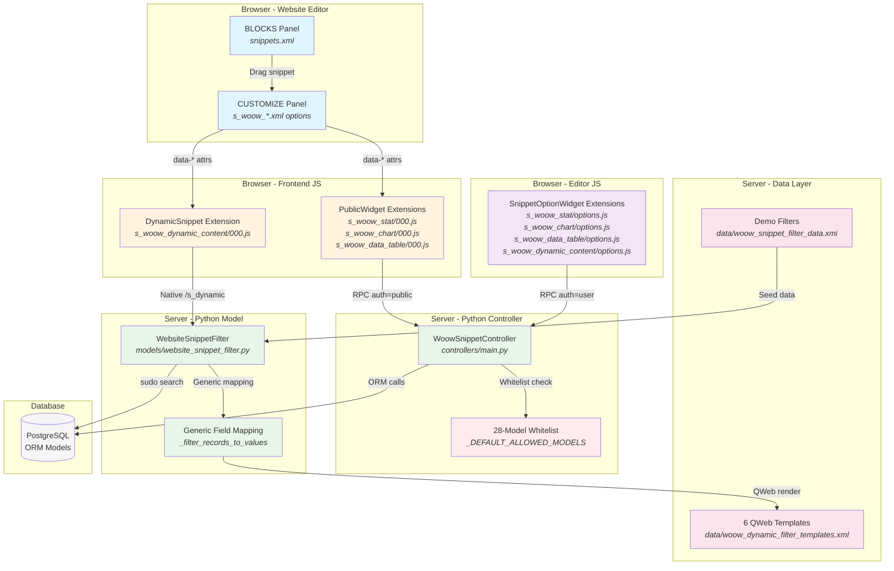
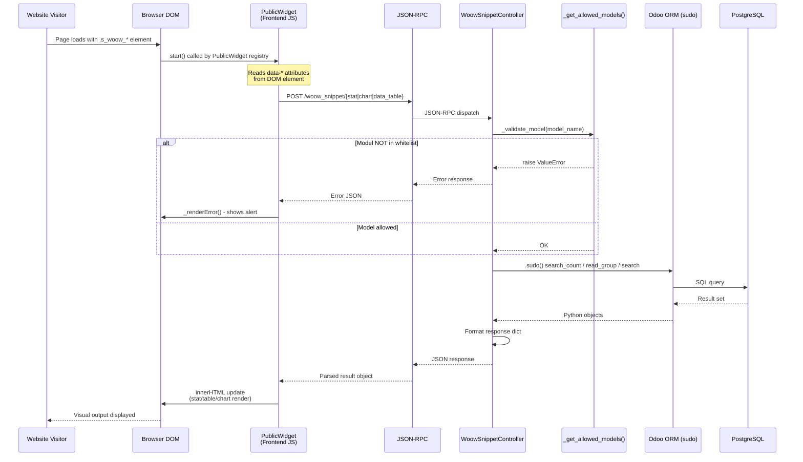
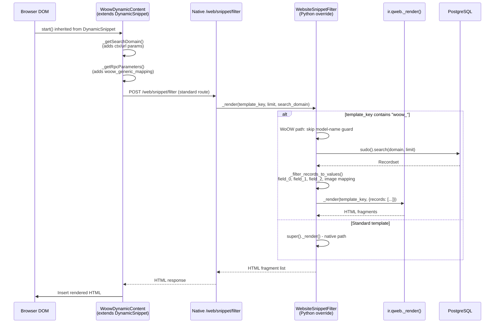
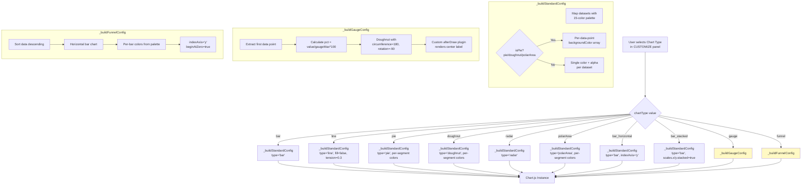
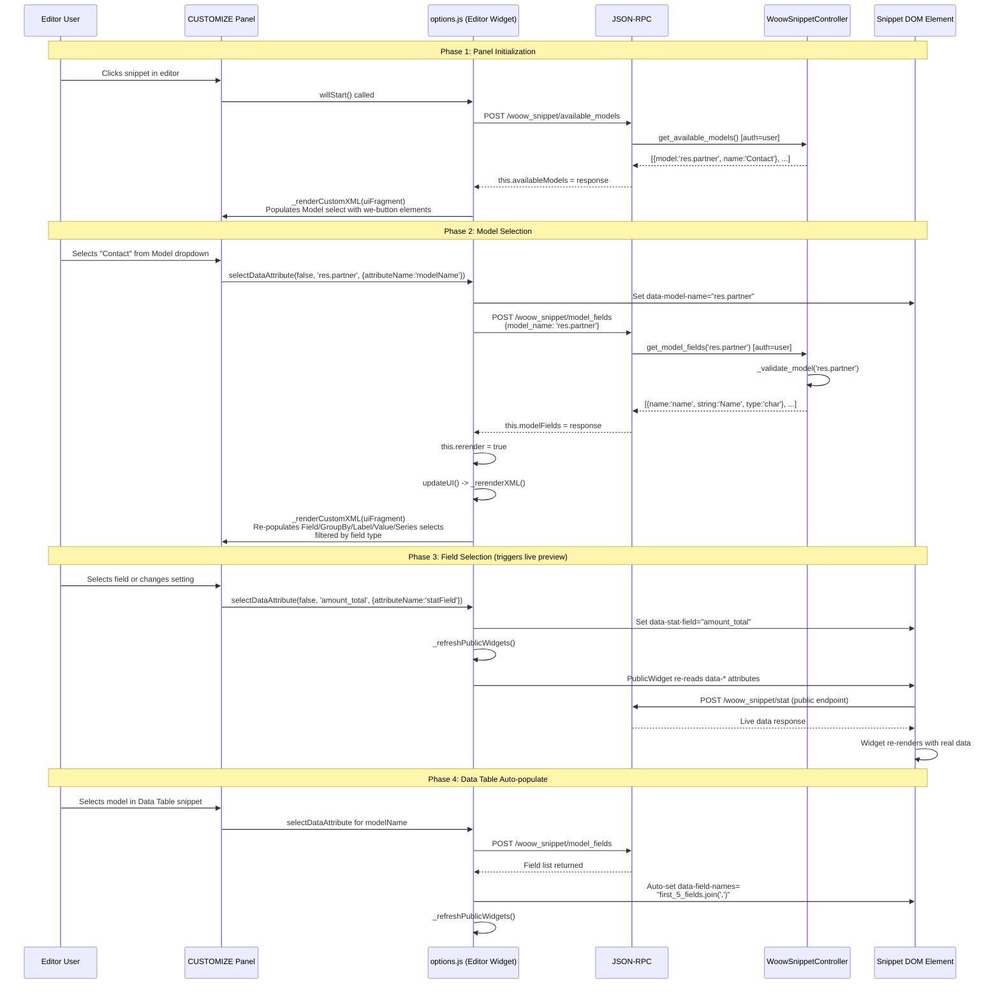
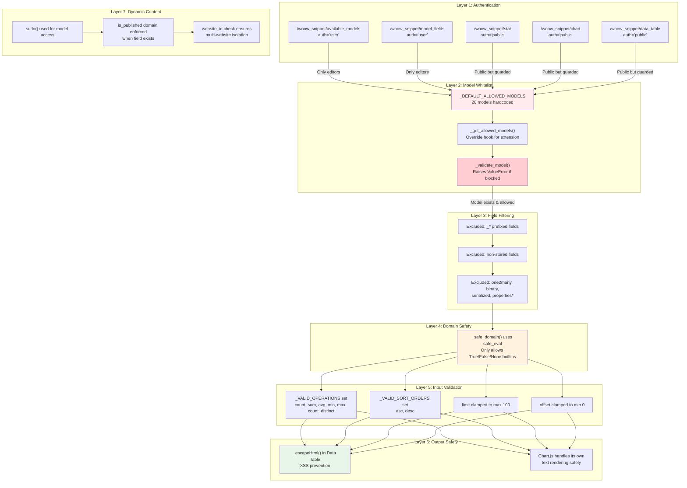
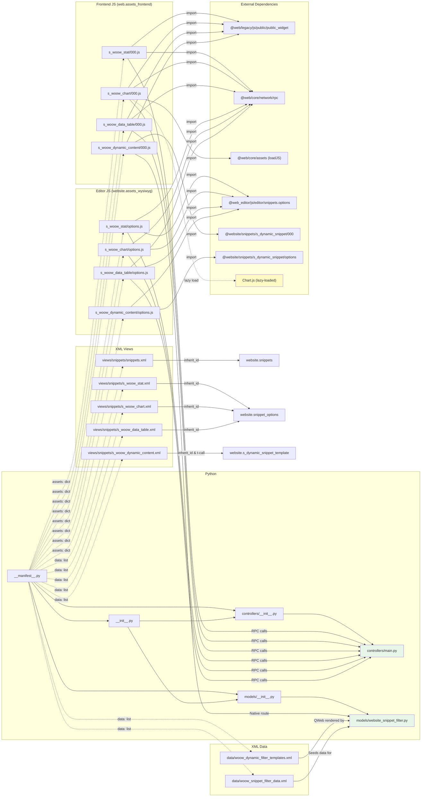

# WoOW Snippet Builder - Technical Architecture Document

**Module**: `woow_snippet_builder`
**Version**: 18.0.2.0.0
**Platform**: Odoo 18 Community/Enterprise
**License**: LGPL-3
**Author**: WoOW Technology

---

## Table of Contents

1. [Executive Summary](#executive-summary)
2. [High-Level Architecture](#high-level-architecture)
3. [Data Flow](#data-flow)
4. [Widget Inheritance Hierarchy](#widget-inheritance-hierarchy)
5. [Rendering Pipeline - Dynamic Content](#rendering-pipeline---dynamic-content)
6. [Chart Type Decision Tree](#chart-type-decision-tree)
7. [Editor Options Flow](#editor-options-flow)
8. [Security Model](#security-model)
9. [File Dependency Graph](#file-dependency-graph)
10. [Component Responsibility Table](#component-responsibility-table)
11. [Data Attribute Reference](#data-attribute-reference)
12. [RPC Endpoint Contracts](#rpc-endpoint-contracts)
13. [Error Handling Flows](#error-handling-flows)
14. [Extension Points](#extension-points)

---

## Executive Summary

WoOW Snippet Builder adds four dynamic website snippets to the Odoo 18 website editor:

| Snippet | Purpose | Data Source |
|---------|---------|-------------|
| **Dynamic Content** | Displays records from any model using configurable QWeb templates | `website.snippet.filter` + `ir.filters` |
| **Stat Card** | Aggregation-based KPI cards (count, sum, avg, min, max) | Direct `read_group` / `search_count` |
| **Chart** | Chart.js visualizations (10 chart types) | Direct `read_group` aggregation |
| **Data Table** | Paginated, searchable, sortable tables | Direct `search` + `read` |

All configuration happens entirely within the website editor BLOCKS and CUSTOMIZE panels. No backend navigation is required.

---

## High-Level Architecture



### Layer Descriptions

| # | Layer | Asset Bundle | Auth Level | Purpose |
|---|-------|--------------|------------|---------|
| 1 | XML Views | N/A (server data) | N/A | Defines snippet bodies, BLOCKS registration, CUSTOMIZE panels |
| 2 | Frontend JS | `web.assets_frontend` | Public | Renders live widgets on published pages |
| 3 | Editor JS | `website.assets_wysiwyg` | User (editor) | Populates CUSTOMIZE panel selects, triggers preview refresh |
| 4 | Python Controller | N/A (server) | Mixed | 2 `auth='user'` + 3 `auth='public'` endpoints |
| 5 | Python Model | N/A (server) | Sudo | Extends `website.snippet.filter` for generic rendering |
| 6 | Data Layer | N/A (server data) | N/A | QWeb templates + demo `ir.filters` records |

---

## Data Flow



### Dynamic Content Flow (Different Path)



---

## Widget Inheritance Hierarchy

```mermaid
classDiagram
    class PublicWidget {
        +selector: string
        +events: object
        +start()
        +destroy()
        +_super()
    }

    class DynamicSnippet {
        +selector: ".s_dynamic_snippet"
        +_getSearchDomain()
        +_getRpcParameters()
        +_fetchData()
    }

    class WoowStatCard {
        +selector: ".s_woow_stat"
        +disabledInEditableMode: false
        +start()
        -_loadAndRender()
        -_renderPlaceholder()
        -_renderError(err)
        -_renderStat(result)
        -_renderDefault(value, result, label)
        -_renderProgress(value, result, label)
        -_renderTrend(value, result, label)
        -_renderThreshold(value, result, label)
        -_renderBreakdown(breakdown)
        -_formatNumber(num)
    }

    class WoowChart {
        +selector: ".s_woow_chart"
        +disabledInEditableMode: false
        -_chartInstance: Chart
        +start()
        +destroy()
        -_loadAndRender()
        -_renderPlaceholder()
        -_renderError(err)
        -_destroyChart()
        -_renderChart(result)
        -_buildStandardConfig(result, chartType)
        -_buildGaugeConfig(result)
        -_buildFunnelConfig(result)
    }

    class WoowDataTable {
        +selector: ".s_woow_data_table"
        +disabledInEditableMode: false
        +events: click/input handlers
        -_currentOffset: int
        -_sortField: string
        -_sortOrder: string
        -_searchTerm: string
        -_searchTimeout: timer
        +start()
        -_onPageClick(ev)
        -_onSortClick(ev)
        -_onSearchInput(ev)
        -_loadAndRender()
        -_renderPlaceholder()
        -_renderError(err)
        -_renderTable(result, ds)
        -_escapeHtml(str)
    }

    class WoowDynamicContent {
        +selector: ".s_woow_dynamic_content"
        -_getSearchDomain()
        -_getRpcParameters()
    }

    class SnippetOptionsClass {
        +willStart()
        +updateUI()
        +selectDataAttribute(previewMode, value, params)
        -_renderCustomXML(uiFragment)
        -_rerenderXML()
        -_refreshPublicWidgets()
    }

    class WoowStatOptions {
        +availableModels: array
        +modelFields: array
        +rerender: bool
        +willStart()
        +selectDataAttribute()
        +updateUI()
        -_renderCustomXML(uiFragment)
    }

    class WoowChartOptions {
        +availableModels: array
        +modelFields: array
        +rerender: bool
        +willStart()
        +selectDataAttribute()
        +updateUI()
        -_renderCustomXML(uiFragment)
    }

    class WoowDataTableOptions {
        +availableModels: array
        +modelFields: array
        +rerender: bool
        +willStart()
        +selectDataAttribute()
        +updateUI()
        -_renderCustomXML(uiFragment)
    }

    class DynamicSnippetOptions {
        +modelNameFilter: string
        +_computeWidgetVisibility()
    }

    class WoowDynamicContentOptions {
        +modelNameFilter: undefined
    }

    PublicWidget <|-- WoowStatCard
    PublicWidget <|-- WoowChart
    PublicWidget <|-- WoowDataTable
    PublicWidget <|-- DynamicSnippet
    DynamicSnippet <|-- WoowDynamicContent

    SnippetOptionsClass <|-- WoowStatOptions
    SnippetOptionsClass <|-- WoowChartOptions
    SnippetOptionsClass <|-- WoowDataTableOptions
    SnippetOptionsClass <|-- DynamicSnippetOptions
    DynamicSnippetOptions <|-- WoowDynamicContentOptions
```



---

## Rendering Pipeline - Dynamic Content

```mermaid
flowchart TD
    A[Page Load] --> B{".s_woow_dynamic_content"<br/>element found?}
    B -->|No| Z[Nothing happens]
    B -->|Yes| C[WoowDynamicContent.start<br/>inherited from DynamicSnippet]

    C --> D[_getSearchDomain called]
    D --> E{data-filter-mode?}

    E -->|by_page_context| F[Scan ancestor<br/>data-woow-ctx-* attrs]
    F --> G[Build domain tuples<br/>from context attributes]

    E -->|by_url_param| H[Parse URL ?woow_*<br/>query parameters]
    H --> I[Build domain tuples<br/>from URL params]

    E -->|none/default| J[Empty extra domain]

    G --> K[Merge into search_domain]
    I --> K
    J --> K

    K --> L[_getRpcParameters<br/>adds woow_generic_mapping=True]
    L --> M[POST /web/snippet/filter<br/>Standard Odoo route]

    M --> N[WebsiteSnippetFilter._render called]
    N --> O{template_key contains<br/>'woow_'?}

    O -->|No| P[super._render<br/>Standard Odoo path]

    O -->|Yes| Q[WoOW Generic Path]
    Q --> R[Check website_id match]
    R --> S[_woow_prepare_values<br/>with sudo]
    S --> T[filter_id.sudo._get_eval_domain]
    T --> U{is_published field<br/>exists on model?}
    U -->|Yes| V[AND domain with<br/>is_published=True]
    U -->|No| W[Use domain as-is]
    V --> X[.sudo.search with domain]
    W --> X

    X --> Y[_filter_records_to_values]
    Y --> AA{woow_generic_mapping<br/>in context?}
    AA -->|No| AB[super._filter_records_to_values]
    AA -->|Yes| AC[Generic Mapping Logic]

    AC --> AD[Parse field_names<br/>comma-separated]
    AD --> AE[For each record:]
    AE --> AF{field type is<br/>binary/image?}
    AF -->|Yes| AG[Set data.image =<br/>/web/image/model/id/field]
    AF -->|No| AH[Set data.field_N = value<br/>increment N]
    AG --> AI[Set call_to_action_url<br/>Set display_name]
    AH --> AI

    AI --> AJ[Return values list]
    AJ --> AK[ir.qweb._render<br/>template_key with records]
    AK --> AL[Parse HTML with lxml]
    AL --> AM[Return list of<br/>HTML fragment strings]

    AM --> AN[Insert fragments<br/>into page DOM]

    style Q fill:#e8f5e9
    style AC fill:#fff3e0
    style AK fill:#e1f5fe
```



---

## Chart Type Decision Tree



### Chart Type to Config Builder Mapping

| Chart Type Value | Config Builder | Underlying Chart.js Type | Special Options |
|-----------------|----------------|--------------------------|-----------------|
| `bar` | `_buildStandardConfig` | `bar` | - |
| `line` | `_buildStandardConfig` | `line` | `fill:false, tension:0.3` |
| `pie` | `_buildStandardConfig` | `pie` | Per-segment colors |
| `doughnut` | `_buildStandardConfig` | `doughnut` | Per-segment colors |
| `radar` | `_buildStandardConfig` | `radar` | - |
| `polarArea` | `_buildStandardConfig` | `polarArea` | Per-segment colors |
| `bar_horizontal` | `_buildStandardConfig` | `bar` | `indexAxis: 'y'` |
| `bar_stacked` | `_buildStandardConfig` | `bar` | `scales.x/y.stacked: true` |
| `gauge` | `_buildGaugeConfig` | `doughnut` | 180-degree arc, center label plugin |
| `funnel` | `_buildFunnelConfig` | `bar` | Sorted descending, horizontal |

---

## Editor Options Flow



### Field Type Filtering Rules

| Option Widget | Select Name | Accepted Field Types |
|---------------|-------------|---------------------|
| `woow_stat` | `field_opt` | `integer`, `float`, `monetary` |
| `woow_stat` | `group_by_opt` | `selection`, `many2one`, `char`, `date`, `datetime`, `boolean` |
| `woow_chart` | `label_field_opt` | `char`, `selection`, `many2one`, `date`, `datetime`, `boolean` |
| `woow_chart` | `value_field_opt` | `integer`, `float`, `monetary` |
| `woow_chart` | `series_field_opt` | `char`, `selection`, `many2one`, `boolean` |
| `woow_data_table` | `fields_opt` | All stored fields (free text input) |

---

## Security Model



### Whitelisted Models (28 total)

| Category | Models |
|----------|--------|
| **CRM/Contacts** | `res.partner`, `res.company`, `res.users`, `crm.lead` |
| **Sales** | `sale.order`, `sale.order.line` |
| **Purchase** | `purchase.order`, `purchase.order.line` |
| **Accounting** | `account.move`, `account.move.line` |
| **Inventory** | `stock.picking`, `stock.move` |
| **Project** | `project.project`, `project.task` |
| **HR** | `hr.employee`, `hr.department` |
| **Helpdesk** | `helpdesk.ticket` |
| **Events** | `event.event`, `event.registration` |
| **Survey** | `survey.survey`, `survey.user_input` |
| **Fleet** | `fleet.vehicle` |
| **Maintenance** | `maintenance.request` |
| **Lunch** | `lunch.order` |
| **Website** | `website.page`, `blog.post` |

### Security Boundary Analysis

```
PUBLIC INTERNET                    SERVER BOUNDARY

  Browser ──────JSON-RPC──────────> [auth check]
                                       │
                                   [whitelist check]
                                       │
                                   [safe_eval domain]
                                       │
                                   [field filter]
                                       │
                                   [ORM .sudo()]
                                       │
                                   [PostgreSQL]
```

**Key Design Decision**: Public endpoints use `.sudo()` to bypass Odoo access rules. Security is enforced at the controller layer via the whitelist, NOT via Odoo's record rules. This means:
- Any model in the whitelist is queryable by anonymous users
- The whitelist is the sole gate for public data access
- Extending the whitelist requires careful security review

---

## File Dependency Graph



---

## Component Responsibility Table

| Component | File | Responsibility | Key Methods/Functions |
|-----------|------|----------------|----------------------|
| **WoowSnippetController** | `controllers/main.py` | Central API gateway; enforces whitelist; aggregates data from ORM | `_get_allowed_models()`, `_validate_model()`, `get_available_models()`, `get_model_fields()`, `get_stat()`, `get_chart()`, `get_data_table()` |
| **WebsiteSnippetFilter** | `models/website_snippet_filter.py` | Extends native filter to support model-agnostic QWeb rendering | `_render()`, `_woow_prepare_values()`, `_filter_records_to_values()` |
| **WoowStatCard** | `s_woow_stat/000.js` | Frontend widget: fetches aggregated stat, renders 4 visual modes | `_loadAndRender()`, `_renderStat()`, `_renderDefault/Progress/Trend/Threshold()`, `_renderBreakdown()`, `_formatNumber()` |
| **WoowChart** | `s_woow_chart/000.js` | Frontend widget: lazy-loads Chart.js, builds config, renders canvas | `_loadAndRender()`, `_renderChart()`, `_buildStandardConfig()`, `_buildGaugeConfig()`, `_buildFunnelConfig()`, `_destroyChart()` |
| **WoowDataTable** | `s_woow_data_table/000.js` | Frontend widget: paginated table with search/sort | `_loadAndRender()`, `_renderTable()`, `_onPageClick()`, `_onSortClick()`, `_onSearchInput()`, `_escapeHtml()` |
| **WoowDynamicContent** | `s_woow_dynamic_content/000.js` | Extends DynamicSnippet with context/URL-based filtering | `_getSearchDomain()`, `_getRpcParameters()` |
| **woow_stat options** | `s_woow_stat/options.js` | Editor panel: populates Model/Field/GroupBy selects | `willStart()`, `selectDataAttribute()`, `_renderCustomXML()` |
| **woow_chart options** | `s_woow_chart/options.js` | Editor panel: populates Model/Label/Value/Series selects | `willStart()`, `selectDataAttribute()`, `_renderCustomXML()` |
| **woow_data_table options** | `s_woow_data_table/options.js` | Editor panel: populates Model select, auto-fills first 5 fields | `willStart()`, `selectDataAttribute()`, `_renderCustomXML()` |
| **woow_dynamic_content options** | `s_woow_dynamic_content/options.js` | Removes model filter restriction from native dynamic snippet options | `modelNameFilter: undefined` |
| **snippets.xml** | `views/snippets/snippets.xml` | Registers "WoOW Dynamic" group in BLOCKS panel with 4 entries | N/A (declarative XML) |
| **QWeb Templates** | `data/woow_dynamic_filter_templates.xml` | 6 rendering themes for dynamic content | `woow_tmpl_card`, `woow_tmpl_list`, `woow_tmpl_hero`, `woow_tmpl_compact`, `woow_tmpl_table`, `woow_tmpl_timeline` |
| **Demo Filters** | `data/woow_snippet_filter_data.xml` | Seed data: 2 `ir.filters` + 2 `website.snippet.filter` records | N/A (data XML) |
| **_safe_domain** | `controllers/main.py` | Parses domain strings safely using `safe_eval` | Returns `[]` on failure |
| **COLORS palette** | `s_woow_chart/000.js` | 15-color array for chart dataset styling | `['#3B82F6', '#10B981', ...]` |

---

## Data Attribute Reference

All snippet configuration is stored as HTML `data-*` attributes on the root `<section>` element. This enables full persistence in the Odoo page HTML without requiring any database-side configuration records (except for Dynamic Content which uses `website.snippet.filter`).

### Stat Card (`<section class="s_woow_stat">`)

| Attribute | Type | Default | Description |
|-----------|------|---------|-------------|
| `data-model-name` | string | `""` | Technical model name (e.g., `res.partner`) |
| `data-operation` | enum | `"count"` | Aggregation: `count`, `sum`, `avg`, `min`, `max`, `count_distinct` |
| `data-stat-field` | string | `""` | Field name for aggregation (required for sum/avg/min/max) |
| `data-group-by` | string | `""` | Field name for breakdown list |
| `data-domain` | string | `"[]"` | Odoo domain expression |
| `data-sub-type` | enum | `"default"` | Visual style: `default`, `progress`, `trend`, `threshold` |
| `data-target-value` | number | `"100"` | Target for progress/threshold calculations |
| `data-threshold-warning` | number | `"50"` | Warning threshold percentage |
| `data-threshold-danger` | number | `"25"` | Danger threshold percentage |
| `data-previous-value` | number | `"0"` | Previous period value for trend delta |

### Chart (`<section class="s_woow_chart">`)

| Attribute | Type | Default | Description |
|-----------|------|---------|-------------|
| `data-model-name` | string | `""` | Technical model name |
| `data-chart-type` | enum | `"bar"` | Chart type: `bar`, `line`, `pie`, `doughnut`, `radar`, `polarArea`, `bar_horizontal`, `bar_stacked`, `gauge`, `funnel` |
| `data-label-field` | string | `""` | X-axis / category field (categorical type) |
| `data-value-field` | string | `""` | Y-axis / aggregation field (numeric type) |
| `data-series-field` | string | `""` | Multi-series grouping field (optional) |
| `data-gauge-max` | number | `"100"` | Maximum value for gauge chart |
| `data-domain` | string | `"[]"` | Odoo domain expression |

### Data Table (`<section class="s_woow_data_table">`)

| Attribute | Type | Default | Description |
|-----------|------|---------|-------------|
| `data-model-name` | string | `""` | Technical model name |
| `data-field-names` | string | `""` | Comma-separated list of field names to display |
| `data-domain` | string | `"[]"` | Odoo domain expression |
| `data-page-size` | number | `"25"` | Records per page (10, 25, 50, 100) |
| `data-searchable` | enum | `"1"` | Show search bar: `1`=yes, `0`=no |
| `data-sortable` | enum | `"1"` | Enable column sorting: `1`=yes, `0`=no |

### Dynamic Content (`<section class="s_woow_dynamic_content">`)

Uses the native `website.s_dynamic_snippet_template` attributes plus:

| Attribute | Type | Default | Description |
|-----------|------|---------|-------------|
| `data-filter-mode` | enum | `""` | Filter injection: `by_page_context`, `by_url_param`, or empty |
| `data-woow-ctx-*` | string | - | (On ancestor) Context field values for page-context mode |

**URL Parameter Convention**: Query parameters prefixed with `woow_` are parsed into domain tuples. Example: `?woow_partner_id=5` becomes `[('partner_id', '=', 5)]`.

---

## RPC Endpoint Contracts

### 1. GET Available Models

```
POST /woow_snippet/available_models
Auth: user (editors only)
Content-Type: application/json

Request Body: {}

Response (200):
{
    "result": [
        {"model": "account.move", "name": "Journal Entry"},
        {"model": "blog.post", "name": "Blog Post"},
        {"model": "crm.lead", "name": "Lead/Opportunity"},
        ...
    ]
}

Errors:
- 403: Not authenticated as internal user
```

### 2. GET Model Fields

```
POST /woow_snippet/model_fields
Auth: user (editors only)
Content-Type: application/json

Request Body:
{
    "params": {
        "model_name": "res.partner"
    }
}

Response (200):
{
    "result": [
        {"name": "name", "string": "Name", "type": "char"},
        {"name": "email", "string": "Email", "type": "char"},
        {"name": "phone", "string": "Phone", "type": "char"},
        {"name": "credit_limit", "string": "Credit Limit", "type": "float"},
        ...
    ]
}

Excluded fields:
- Fields starting with '_'
- Non-stored (computed without store=True)
- Types: one2many, binary, serialized, properties, properties_definition

Errors:
- ValueError: Model not in whitelist or doesn't exist
- 403: Not authenticated
```

### 3. GET Stat Data

```
POST /woow_snippet/stat
Auth: public
Content-Type: application/json
Route flags: readonly=True

Request Body:
{
    "params": {
        "model_name": "sale.order",        // Required
        "operation": "sum",                 // count|sum|avg|min|max|count_distinct
        "field_name": "amount_total",       // Required for sum/avg/min/max
        "group_by": "state",               // Optional
        "domain": "[('state','=','sale')]", // Optional, default "[]"
        "sub_type": "progress",            // default|progress|trend|threshold
        "target_value": 50000,             // For progress/threshold
        "threshold_warning": 50,           // For threshold
        "threshold_danger": 25,            // For threshold
        "previous_value": 35000            // For trend
    }
}

Response (200) - default sub_type:
{
    "result": {
        "value": 125000,
        "sub_type": "default",
        "breakdown": [
            {"label": "Quotation", "value": 12},
            {"label": "Sales Order", "value": 45}
        ]
    }
}

Response (200) - progress sub_type:
{
    "result": {
        "value": 37500,
        "sub_type": "progress",
        "breakdown": [...],
        "target": 50000,
        "percent": 75.0
    }
}

Response (200) - trend sub_type:
{
    "result": {
        "value": 42000,
        "sub_type": "trend",
        "breakdown": [...],
        "delta": 7000,
        "delta_percent": 20.0
    }
}

Response (200) - threshold sub_type:
{
    "result": {
        "value": 15000,
        "sub_type": "threshold",
        "breakdown": [...],
        "target": 50000,
        "percent": 30.0,
        "status": "warning"    // "success"|"warning"|"danger"
    }
}
```

### 4. GET Chart Data

```
POST /woow_snippet/chart
Auth: public
Content-Type: application/json
Route flags: readonly=True

Request Body:
{
    "params": {
        "model_name": "sale.order",
        "chart_type": "bar",
        "label_field": "state",
        "value_field": "amount_total",
        "domain": "[]",
        "gauge_max": 100,
        "series_field": ""                 // Optional: enables multi-series
    }
}

Response (200) - Single series:
{
    "result": {
        "labels": ["Draft", "Confirmed", "Done"],
        "datasets": [
            {"label": "amount_total", "data": [5000, 25000, 95000]}
        ],
        "chart_type": "bar",
        "gauge_max": 100
    }
}

Response (200) - Multi-series (series_field set):
{
    "result": {
        "labels": ["Q1", "Q2", "Q3", "Q4"],
        "datasets": [
            {"label": "John", "data": [10000, 15000, 12000, 18000]},
            {"label": "Jane", "data": [8000, 22000, 19000, 14000]}
        ],
        "chart_type": "bar",
        "gauge_max": 100
    }
}

Notes:
- When value_field is 'id' or '__count', uses record count instead of aggregation
- read_group with lazy=False for multi-series grouping
- Returns empty {labels:[], datasets:[]} when label_field or value_field missing
```

### 5. GET Data Table

```
POST /woow_snippet/data_table
Auth: public
Content-Type: application/json
Route flags: readonly=True

Request Body:
{
    "params": {
        "model_name": "res.partner",
        "field_names": "name,email,city,phone",
        "domain": "[('is_company','=',True)]",
        "offset": 0,
        "limit": 25,
        "sort_field": "name",
        "sort_order": "asc",
        "search_term": "tech"
    }
}

Response (200):
{
    "result": {
        "columns": [
            {"name": "name", "string": "Name", "type": "char"},
            {"name": "email", "string": "Email", "type": "char"},
            {"name": "city", "string": "City", "type": "char"},
            {"name": "phone", "string": "Phone", "type": "char"}
        ],
        "rows": [
            {"id": 1, "name": "TechCorp", "email": "info@tech.com", "city": "SF", "phone": "+1..."},
            {"id": 2, "name": "DevTech", "email": "hi@dev.io", "city": "NYC", "phone": "+1..."}
        ],
        "total": 47,
        "offset": 0,
        "limit": 25
    }
}

Notes:
- limit clamped: min=1, max=100
- offset clamped: min=0
- search_term triggers OR-ed ilike on all char/text/html fields
- Many2one values resolved to display_name
- Many2many values joined with ', '
- Invalid field names silently skipped
```

---

## Error Handling Flows

```mermaid
flowchart TD
    subgraph "Frontend Error Handling"
        A[Widget._loadAndRender] --> B{RPC call}
        B -->|Success| C[_renderStat/_renderChart/_renderTable]
        B -->|Exception| D[catch block]
        D --> E[_renderError method]
        E --> F["Display: exclamation-triangle icon<br/>+ err.message or fallback text"]
    end

    subgraph "Placeholder State"
        G[Widget.start] --> H{Required data-* attrs<br/>present?}
        H -->|No| I[_renderPlaceholder]
        I --> J["Display: icon + 'Configure in<br/>Customize panel' message"]
        H -->|Yes| A
    end

    subgraph "Controller Error Handling"
        K[Controller endpoint] --> L{_validate_model}
        L -->|Model not in whitelist| M[raise ValueError<br/>'Model X is not allowed']
        L -->|Model not in env| N[raise ValueError<br/>'Model X does not exist']
        L -->|Valid| O[Continue processing]

        O --> P{Operation valid?}
        P -->|No| Q[raise ValueError<br/>'Invalid operation']
        P -->|Yes| R[Execute ORM call]

        R --> S{ORM exception?}
        S -->|read_group fails| T[return empty/fallback<br/>groups = [] via try/except]
        S -->|Success| U[Return result dict]
    end

    subgraph "Domain Parse Errors"
        V["_safe_domain(domain_str)"] --> W{safe_eval succeeds?}
        W -->|Yes| X[Return parsed domain]
        W -->|No| Y[Log warning]
        Y --> Z[Return empty domain []]
    end

    subgraph "Chart.js Availability"
        AA[_renderChart] --> AB{typeof Chart === undefined?}
        AB -->|Yes| AC["loadJS('/web/static/lib/Chart/Chart.js')"]
        AC --> AD{Still undefined?}
        AD -->|Yes| AE["_renderError({message: 'Chart.js not available'})"]
        AD -->|No| AF[Proceed with chart creation]
        AB -->|No| AF
    end
```

### Error Recovery Strategy

| Error Type | Location | Recovery Behavior |
|-----------|----------|-------------------|
| Missing config (`data-*` empty) | Frontend JS | Shows placeholder with instructions |
| RPC network failure | Frontend JS | Shows error icon + message |
| Model not whitelisted | Controller | ValueError propagated as RPC error |
| Invalid domain string | Controller | Silently defaults to `[]`, logs warning |
| Invalid operation | Controller | ValueError propagated as RPC error |
| `read_group` fails | Controller | Returns empty array via try/except |
| Chart.js not loaded | Frontend JS | Attempts `loadJS`, shows error if still unavailable |
| Field doesn't exist | Controller | Silently skipped (data table) or empty result |
| XSS in data values | Frontend JS | `_escapeHtml()` sanitizes all user-visible text in Data Table |

---

## Extension Points

### 1. Adding New Models to the Whitelist

**Method**: Override `_get_allowed_models()` in a custom controller.

```python
# my_module/controllers/main.py
from woow_snippet_builder.controllers.main import WoowSnippetController

class CustomWoowController(WoowSnippetController):

    def _get_allowed_models(self):
        models = super()._get_allowed_models()
        models.add('my.custom.model')
        models.add('another.model')
        return models
```

### 2. Adding New QWeb Templates for Dynamic Content

Create a new template in your module's data XML:

```xml
<template id="dynamic_filter_template_woow_my_theme" name="WoOW My Theme">
    <t t-foreach="records" t-as="data"
       data-number-of-elements="3"
       data-number-of-elements-sm="1"
       data-thumb="/my_module/static/src/img/my_thumb.svg">
        <!-- Use field_0, field_1, field_2, image keys -->
        <div class="my-card">
            <h3 t-out="data.get('field_0', '')"/>
            <p t-out="data.get('field_1', '')"/>
        </div>
    </t>
</template>
```

The template will automatically appear in the Dynamic Content snippet's template selector because `WoowDynamicContentOptions` sets `modelNameFilter: undefined`, allowing all `website.snippet.filter` templates.

### 3. Adding New Chart Types

Extend the `WoowChart` widget and add a new config builder:

```javascript
import WoowChart from "@woow_snippet_builder/snippets/s_woow_chart/000";

WoowChart.include({
    async _renderChart(result) {
        const chartType = result.chart_type;
        if (chartType === 'my_custom_type') {
            // Build and apply custom config
            const config = this._buildMyCustomConfig(result);
            // ... render
            return;
        }
        return this._super(...arguments);
    },

    _buildMyCustomConfig(result) {
        // Return Chart.js config object
    },
});
```

Then add the option to the CUSTOMIZE panel by inheriting the XML:

```xml
<template id="s_woow_chart_options_extend" inherit_id="woow_snippet_builder.s_woow_chart_options">
    <xpath expr="//we-select[@data-attribute-name='chartType']" position="inside">
        <we-button data-select-data-attribute="my_custom_type">My Custom</we-button>
    </xpath>
</template>
```

### 4. Adding Custom Stat Sub-Types

Extend `WoowStatCard` to add new rendering modes:

```javascript
import WoowStatCard from "@woow_snippet_builder/snippets/s_woow_stat/000";

WoowStatCard.include({
    _renderStat(result) {
        if (result.sub_type === 'my_gauge') {
            const el = this.el.querySelector('.woow_stat_content');
            el.innerHTML = this._renderMyGauge(result);
            return;
        }
        return this._super(...arguments);
    },
    _renderMyGauge(result) {
        return `<div>Custom gauge: ${result.value}</div>`;
    },
});
```

### 5. Adding Custom Search Domain Logic (Dynamic Content)

Extend `WoowDynamicContent` to support additional domain injection strategies:

```javascript
import WoowDynamicContent from "@woow_snippet_builder/snippets/s_woow_dynamic_content/000";

WoowDynamicContent.include({
    _getSearchDomain() {
        const domain = this._super(...arguments);
        const ds = this.el.dataset;

        if (ds.filterMode === 'by_session') {
            // Custom: read from sessionStorage
            const val = sessionStorage.getItem('woow_filter');
            if (val) domain.push(JSON.parse(val));
        }

        return domain;
    },
});
```

### 6. Custom Field Mapping in _filter_records_to_values

Override in a custom model:

```python
from woow_snippet_builder.models.website_snippet_filter import WebsiteSnippetFilter

class CustomSnippetFilter(WebsiteSnippetFilter):
    _inherit = 'website.snippet.filter'

    def _filter_records_to_values(self, records, is_sample=False):
        if not self.env.context.get('my_custom_mapping'):
            return super()._filter_records_to_values(records, is_sample=is_sample)
        # Custom mapping logic
        values = []
        for record in records:
            values.append({
                'field_0': record.name,
                'field_1': record.computed_summary,
                'image': f'/web/image/{record._name}/{record.id}/avatar',
            })
        return values
```

### 7. Extending the Editor Options Panel

Inherit the XML to add new controls:

```xml
<template id="s_woow_stat_options_extend"
          inherit_id="woow_snippet_builder.s_woow_stat_options">
    <xpath expr="//we-input[@data-attribute-name='domain']" position="after">
        <we-input string="Refresh Interval (ms)"
                  data-attribute-name="refreshInterval"
                  data-no-preview="true"/>
    </xpath>
</template>
```

---

## Appendix A: Color Palette

The chart widget uses a 15-color palette for dataset differentiation:

| Index | Hex Code | Usage |
|-------|----------|-------|
| 0 | `#3B82F6` | Primary blue |
| 1 | `#10B981` | Emerald green |
| 2 | `#F59E0B` | Amber |
| 3 | `#EF4444` | Red |
| 4 | `#8B5CF6` | Violet |
| 5 | `#EC4899` | Pink |
| 6 | `#06B6D4` | Cyan |
| 7 | `#84CC16` | Lime |
| 8 | `#F97316` | Orange |
| 9 | `#6366F1` | Indigo |
| 10 | `#14B8A6` | Teal |
| 11 | `#E11D48` | Rose |
| 12 | `#0EA5E9` | Sky blue |
| 13 | `#A855F7` | Purple |
| 14 | `#22C55E` | Green |

Colors cycle with modulo for datasets exceeding 15.

---

## Appendix B: QWeb Template Field Mapping

The generic mapping system in `_filter_records_to_values` produces these keys:

| Key | Source | Notes |
|-----|--------|-------|
| `field_0` | First non-binary field in `field_names` | Usually the record name |
| `field_1` | Second non-binary field | Usually a description field |
| `field_2` | Third non-binary field | Optional tertiary info |
| `field_N` | Nth non-binary field | Continues incrementing |
| `image` | First binary/image field found | URL: `/web/image/{model}/{id}/{field}` |
| `display_name` | `record.display_name` | Always present |
| `call_to_action_url` | `record.website_url` or `'#'` | Link target |
| `_record` | Full record object | Internal use by QWeb |

---

## Appendix C: Module File Tree

```
woow_snippet_builder/
|-- __init__.py
|-- __manifest__.py
|-- controllers/
|   |-- __init__.py
|   `-- main.py                          # 5 RPC endpoints + whitelist
|-- data/
|   |-- woow_dynamic_filter_templates.xml  # 6 QWeb templates
|   `-- woow_snippet_filter_data.xml       # Demo ir.filters + snippet.filter
|-- models/
|   |-- __init__.py
|   `-- website_snippet_filter.py         # _render override + generic mapping
|-- static/
|   `-- src/
|       |-- img/
|       |   `-- snippets_thumbs/          # SVG thumbnails for BLOCKS panel
|       `-- snippets/
|           |-- s_woow_chart/
|           |   |-- 000.js                # Chart.js frontend widget
|           |   `-- options.js            # Editor options (model/fields)
|           |-- s_woow_data_table/
|           |   |-- 000.js                # Data table frontend widget
|           |   `-- options.js            # Editor options (model/fields)
|           |-- s_woow_dynamic_content/
|           |   |-- 000.js                # DynamicSnippet extension
|           |   `-- options.js            # Removes modelNameFilter
|           `-- s_woow_stat/
|               |-- 000.js                # Stat card frontend widget
|               `-- options.js            # Editor options (model/fields)
`-- views/
    `-- snippets/
        |-- s_woow_chart.xml              # Body + CUSTOMIZE panel
        |-- s_woow_data_table.xml         # Body + CUSTOMIZE panel
        |-- s_woow_dynamic_content.xml    # Body (t-call native) + panel
        |-- s_woow_stat.xml               # Body + CUSTOMIZE panel
        `-- snippets.xml                  # BLOCKS panel group registration
```

---

## Appendix D: Deployment and Dependencies

### Odoo Module Dependencies

```
woow_snippet_builder
    └── website (core module)
            ├── web_editor
            ├── web
            └── base
```

### External Library Dependencies

| Library | Version | Loading | Purpose |
|---------|---------|---------|---------|
| Chart.js | Bundled with Odoo | Lazy-loaded via `loadJS()` | Chart rendering |

### Asset Bundle Registration

| Bundle | Files | When Loaded |
|--------|-------|-------------|
| `web.assets_frontend` | 4 `000.js` files | Every public page visit |
| `website.assets_wysiwyg` | 4 `options.js` files | Only in editor mode |

---

*Document generated from source code analysis of `woow_snippet_builder` v18.0.2.0.0*
