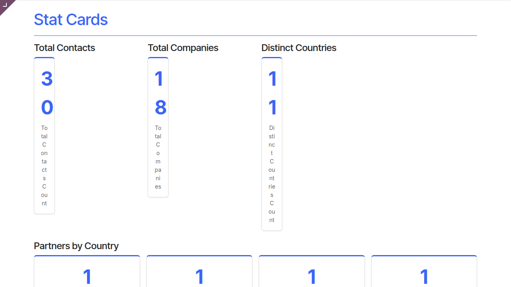
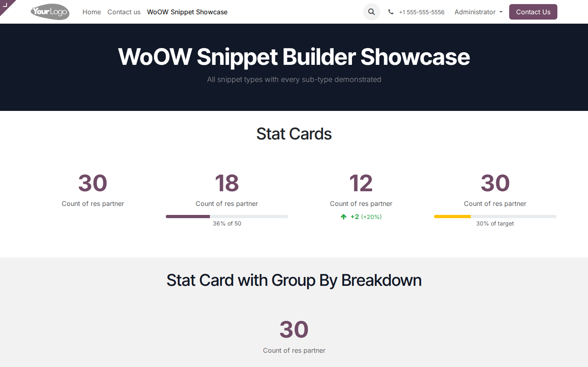
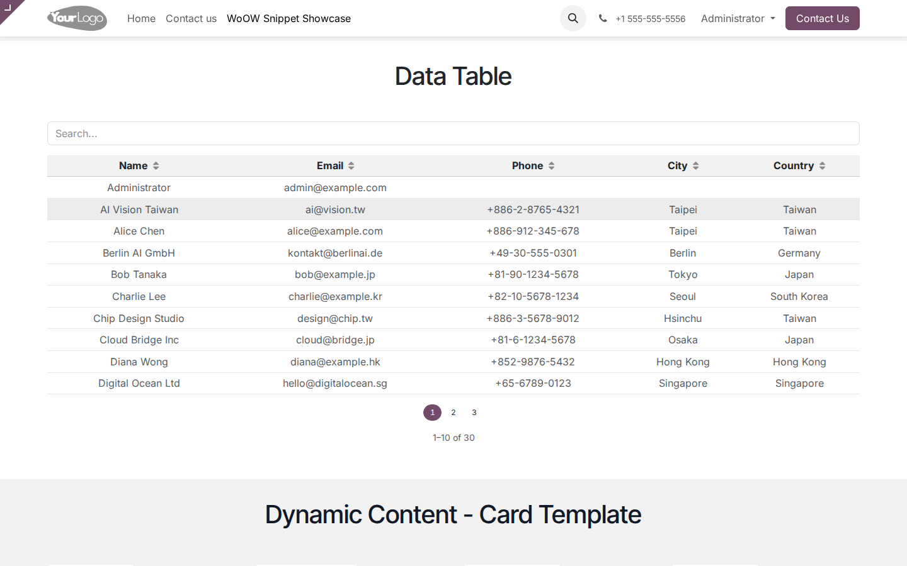
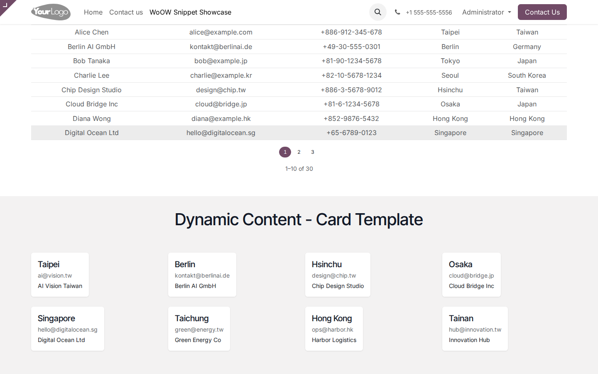
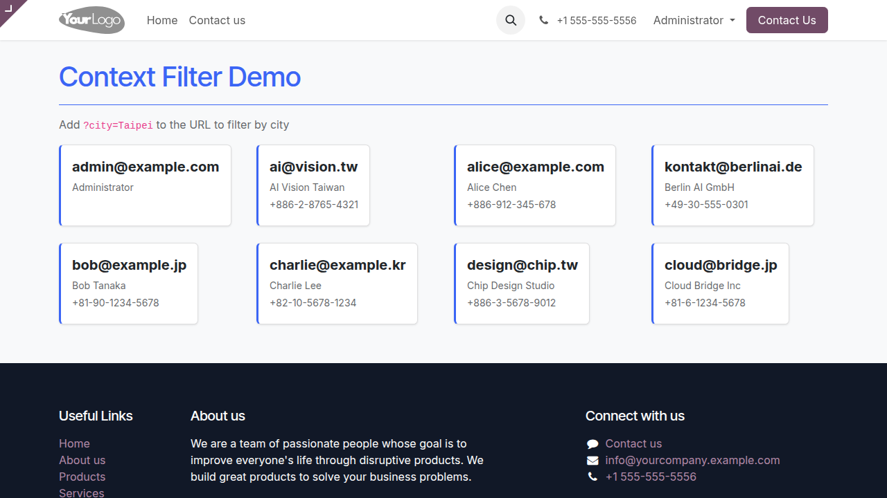
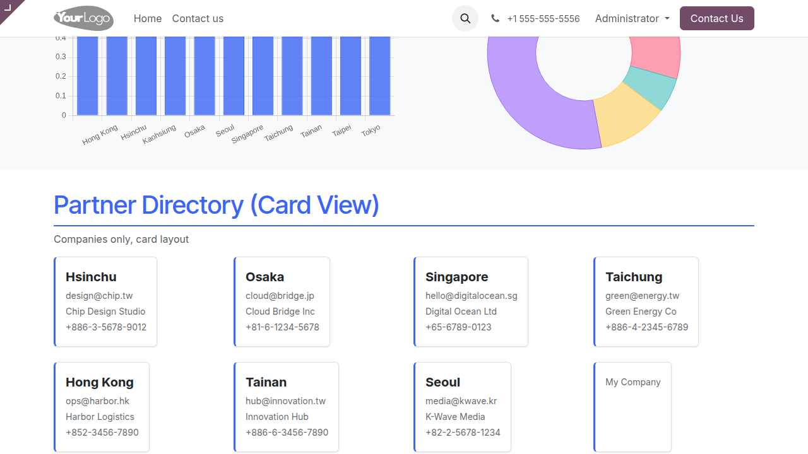
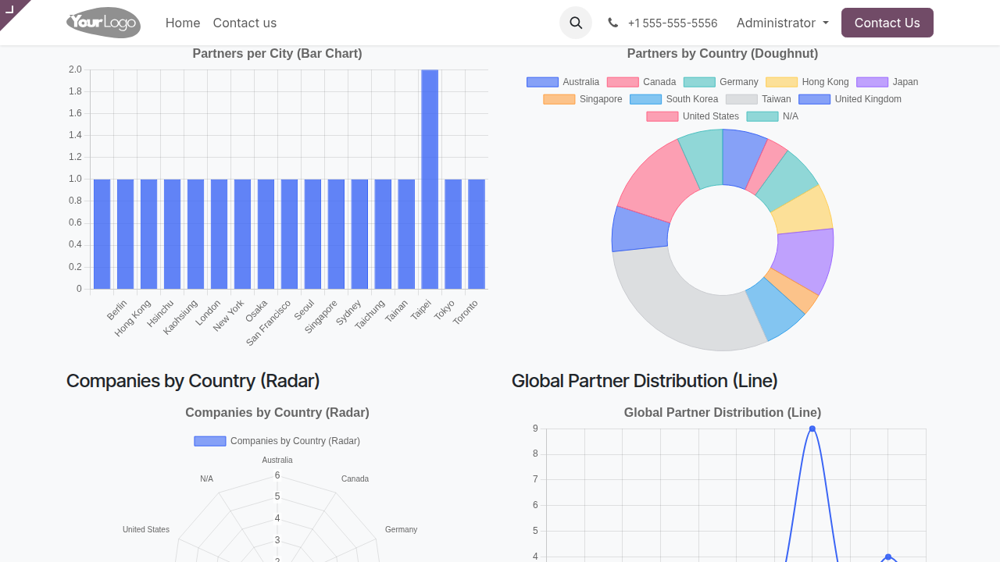
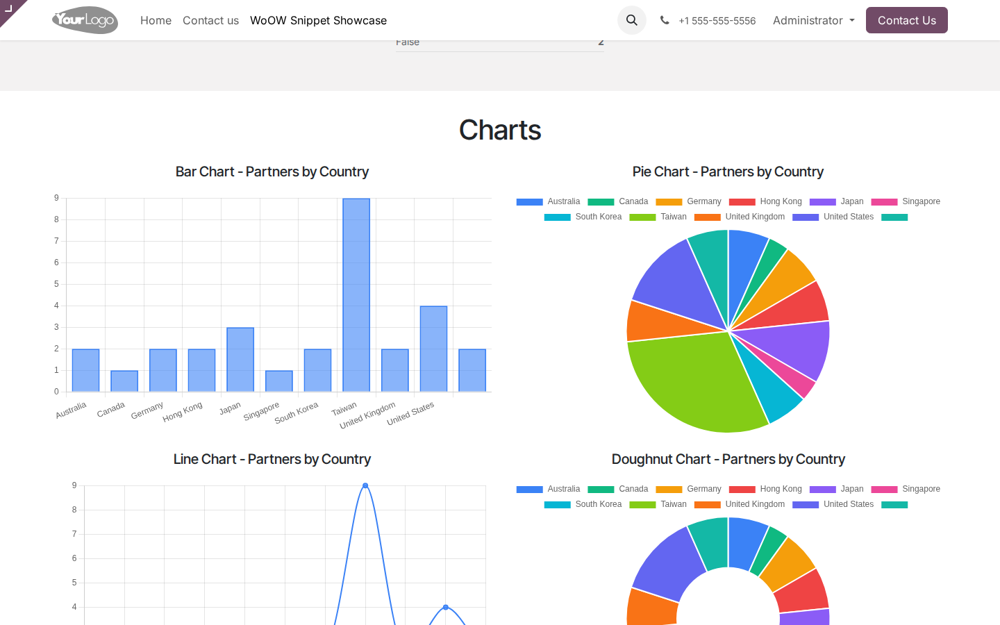

# WoOW Snippet Builder — 使用教學手冊

> **歡迎！** 這份手冊會手把手帶你學會怎麼用 WoOW Snippet Builder，讓你的 Odoo 網站瞬間擁有動態數據看板、圖表、統計卡片和資料表格。完全不用寫程式、不用碰後台設定 — 只要在網站編輯器裡拖拖拉拉，幾分鐘就搞定。不管你是第一次用 Odoo 網站編輯器，還是已經很熟的老手，這份手冊都能幫到你。

> **📸 截圖說明：** 本手冊中的截圖參考路徑指向預期的操作畫面。部分截圖已收錄於 [截圖集](SCREENSHOTS.md)，其餘為操作情境示意，將於未來版本補充。

---

## 目錄

| 章節 | 說明 | 適合誰看 |
|------|------|----------|
| [快速開始（2 分鐘上手）](#快速開始2-分鐘上手) | 模組簡介、快速導航、角色說明 | 所有人 |
| [Part A: 網站編輯者教學](#part-a-網站編輯者教學) | 四種元件的完整操作教學 | 網站編輯者 |
| [Part B: 管理員教學](#part-b-管理員教學) | 安裝、設定、維護 | 管理員 |
| [附錄](#附錄) | FAQ、名詞解釋、速查表 | 所有人 |

---

## 快速開始（2 分鐘上手）

### 這是什麼？

想像你的 Odoo 網站是一塊空白的佈告欄。WoOW Snippet Builder 就像是一組「智慧磁鐵貼」— 你只要把它們貼上去，它們就會自動從你的 Odoo 資料庫裡抓資料、即時顯示在網頁上。

這組磁鐵貼一共有 **4 種**：

| 元件 | 功能一句話說明 | 適合用在 |
|------|----------------|----------|
| **Stat Card（統計卡片）** | 顯示一個大數字，像是「客戶總數：1,234」 | 儀表板、首頁重點數據 |
| **Chart（圖表）** | 畫出長條圖、圓餅圖、折線圖等 10 種圖表 | 銷售報表、數據趨勢 |
| **Data Table（資料表格）** | 顯示可搜尋、可排序、可翻頁的表格 | 客戶清單、訂單列表 |
| **Dynamic Content（動態內容）** | 用卡片牆、清單、時間軸等 6 種版型顯示資料 | 產品展示、部落格文章、活動列表 |

全部 4 種元件都在網站編輯器的 **BLOCKS（區塊）** 面板裡，歸類在 **「WoOW Dynamic」** 群組下面。拖進頁面之後，用右側的 **CUSTOMIZE（自訂）** 面板來設定要顯示什麼資料。就這麼簡單。

---

### 我想要...（快速導航）

| 我想要... | 請看 |
|-----------|------|
| 在首頁放一個「客戶總數」的大數字 | [A1. 第一次使用：在頁面上放一個 Stat Card](#a1-第一次使用在頁面上放一個-stat-card完整教學情境) |
| 畫一張銷售長條圖 | [A2. 用 Chart 呈現銷售數據](#a2-用-chart-呈現銷售數據) |
| 顯示一個可搜尋的客戶清單表格 | [A3. 放一個 Data Table 顯示客戶清單](#a3-放一個-data-table-顯示客戶清單) |
| 用漂亮的卡片牆展示產品 | [A4. 用 Dynamic Content 顯示產品卡片牆](#a4-用-dynamic-content-顯示產品卡片牆) |
| 只顯示特定條件的資料（例如只顯示台北的客戶） | [A5. 進階設定：Domain 過濾](#a5-進階設定domain-過濾) |
| 讓元件根據頁面上下文或網址參數動態過濾 | [A6. 進階設定：頁面上下文過濾 & URL 參數過濾](#a6-進階設定頁面上下文過濾--url-參數過濾) |
| 挑選最適合的圖表類型 | [A7. 選擇合適的圖表類型](#a7-選擇合適的圖表類型) |
| 安裝這個模組 | [B1. 安裝與啟用模組](#b1-安裝與啟用模組) |
| 知道哪些模型可以查詢 | [B2. 瞭解允許的模型清單](#b2-瞭解允許的模型清單) |
| 升級模組 | [B3. 模組升級與維護](#b3-模組升級與維護) |
| 解決常見問題 | [附錄 A: 常見問題 (FAQ)](#附錄-a-常見問題-faq) |

---

### 兩種使用者角色

這個模組只有兩種人會用到：

| 角色 | 誰 | 做什麼 |
|------|----|--------|
| **網站編輯者** | 負責編輯網站頁面的人 | 在網站編輯器裡拖放元件、設定要顯示什麼資料 |
| **管理員** | 負責管理 Odoo 系統的人 | 安裝／升級模組、管理允許查詢的模型 |

> **小提示：** 大部分時候，你只需要看 Part A（網站編輯者教學）就夠了。管理員的部分只有在安裝或升級時才需要看。

---

### 安裝完成後的第一件事

模組安裝好之後，你可以馬上驗證它有沒有正確載入：

1. 打開 Odoo 前台網站（點選左上角的「網站」App）
2. 點擊頁面右上角的 **「編輯」** 按鈕進入網站編輯器
3. 看左側的 **BLOCKS（區塊）** 面板，往下捲，你應該會看到一個叫做 **「WoOW Dynamic」** 的群組
4. 點開它，裡面應該有 4 個元件：Dynamic Content、Stat Card、Chart、Data Table

<!--  -->
<!-- *截圖待補充* -->

如果你看到了，恭喜！模組安裝成功，可以開始使用了。

> **常見錯誤：** 如果看不到「WoOW Dynamic」群組，請確認模組已經安裝並且啟用。詳情請看 [B1. 安裝與啟用模組](#b1-安裝與啟用模組)。

---

## Part A: 網站編輯者教學

### A1. 第一次使用：在頁面上放一個 Stat Card（完整教學情境）

> **你將學到：**
> - 怎麼從 BLOCKS 面板拖放元件到頁面上
> - 怎麼用 CUSTOMIZE 面板設定元件
> - Stat Card 的 4 種顯示樣式：Default、Progress Bar、Trend、Threshold

#### 情境

你是公司網站的編輯，老闆說：「我想在首頁放一個大大的數字，讓大家一眼就看到我們有多少客戶。」

好，我們來做。

#### 步驟

**Step 1：進入網站編輯器**

1. 登入 Odoo 後台
2. 點擊左上角的 **「網站」** App，進入前台網站
3. 瀏覽到你想放統計卡片的頁面（例如首頁）
4. 點擊頁面右上角的 **「編輯」** 按鈕

<!--  -->
<!-- *截圖待補充* -->

**Step 2：找到 WoOW Dynamic 群組**

1. 進入編輯器後，左側會出現 **BLOCKS（區塊）** 面板
2. 往下捲動，找到 **「WoOW Dynamic」** 群組
3. 點開它，你會看到 4 個元件

<!--  -->
<!-- *截圖待補充* -->

**Step 3：拖放 Stat Card 到頁面上**

1. 用滑鼠按住 **「Stat Card」** 元件
2. 拖到頁面上你想放的位置
3. 放開滑鼠

放好之後，頁面上會出現一個灰色的佔位區塊，上面寫著「Configure this stat card in the Customize panel」。別擔心，這是正常的 — 因為我們還沒告訴它要顯示什麼。

<!--  -->
<!-- *截圖待補充* -->

**Step 4：用 CUSTOMIZE 面板設定**

1. 確認你已經點選了剛放上去的 Stat Card 區塊（它周圍會有藍色框線）
2. 看右側面板，它會自動切換到 **CUSTOMIZE（自訂）** 面板
3. 你會看到這些設定欄位：

| 欄位 | 說明 | 範例 |
|------|------|------|
| **Model（模型）** | 你要查詢哪個資料表 | 選擇「Contact」（就是 res.partner） |
| **Operation（運算）** | 要做什麼計算 | 選擇「Count」（計算數量） |
| **Field（欄位）** | 如果是 Sum/Avg/Min/Max，要用哪個數字欄位 | Count 不需要選 |
| **Group By（分組）** | 要不要按某個欄位分組顯示明細 | 可以不選 |
| **Style（樣式）** | 顯示風格 | 選擇「Default」 |
| **Target Value（目標值）** | Progress Bar 和 Threshold 樣式用的 | 預設 100 |
| **Previous Value（前期值）** | Trend 樣式用的 | 預設 0 |
| **Domain（條件）** | 過濾條件 | 留空表示查全部 |

4. 在 **Model** 下拉選單中，選擇 **「Contact」**
5. 在 **Operation** 下拉選單中，選擇 **「Count」**
6. **Style** 保持 **「Default」**

<!--  -->
<!-- *截圖待補充* -->

**Step 5：看結果**

設定完之後，頁面上的 Stat Card 會立刻顯示你的客戶總數，一個漂亮的大數字，下面標註「Count of res partner」。



**Step 6：儲存**

點擊頁面右上角的 **「儲存」** 按鈕，搞定！

---

#### Stat Card 的 4 種樣式

在 CUSTOMIZE 面板的 **Style** 欄位，有 4 種選擇：

**1. Default（預設）**
- 就是一個大數字，下面有說明文字
- 最簡單、最直觀

**2. Progress Bar（進度條）**
- 大數字下面多一條進度條
- 會顯示「目前值佔目標值的百分比」
- 需要設定 **Target Value**（目標值）
- 例如：目標 1000 個客戶，目前有 750 個 → 顯示 75%



**3. Trend（趨勢）**
- 大數字下面多一個箭頭，顯示跟前期比是上升還是下降
- 需要設定 **Previous Value**（前期值）
- 例如：上個月 500，這個月 650 → 顯示綠色向上箭頭 +150 (+30%)

<!--  -->
<!-- *截圖待補充* -->

**4. Threshold（門檻）**
- 跟 Progress Bar 很像，但進度條會根據達標程度變色
- 綠色 = 達標（>= 警告門檻）
- 黃色 = 注意（>= 危險門檻但 < 警告門檻）
- 紅色 = 危險（< 危險門檻）
- 預設警告門檻是 50%、危險門檻是 25%

<!--  -->
<!-- *截圖待補充* -->

> **小提示：** 如果你選了 Count 運算，不需要選 Field 欄位，因為 Count 只是數「有幾筆資料」。只有選 Sum（加總）、Avg（平均）、Min（最小）、Max（最大）時才需要指定一個數字欄位。

> **常見錯誤：** 忘記選 Model 就直接儲存 — 元件會一直顯示灰色佔位文字。記得一定要先選一個 Model。

---

### A2. 用 Chart 呈現銷售數據

> **你將學到：**
> - 怎麼放一個 Chart 元件到頁面上
> - 怎麼設定圖表的資料來源和類型
> - 怎麼用 Series Field 做多系列圖表
> - 10 種圖表類型的差別

#### 情境

業務主管說：「我想在內部門戶頁面放一張長條圖，顯示各國家的銷售訂單金額。」

#### 步驟

**Step 1：進入編輯器，拖放 Chart 元件**

1. 進入網站編輯器（跟 A1 的 Step 1 一樣）
2. 從 BLOCKS 面板的 **「WoOW Dynamic」** 群組中，把 **「Chart」** 拖到頁面上
3. 你會看到一個灰色佔位區塊：「Configure this chart in the Customize panel」

<!--  -->
<!-- *截圖待補充* -->

**Step 2：在 CUSTOMIZE 面板中設定**

點選 Chart 區塊，右側會出現 CUSTOMIZE 面板，有這些欄位：

| 欄位 | 說明 | 範例 |
|------|------|------|
| **Model（模型）** | 要查詢哪個資料表 | 選擇「Sales Order」 |
| **Chart Type（圖表類型）** | 要畫什麼圖 | 選擇「Bar」 |
| **Label Field（標籤欄位）** | X 軸要用什麼欄位分類 | 選擇「Partner」（客戶）或適合分類的欄位 |
| **Value Field（數值欄位）** | Y 軸要顯示什麼數字 | 選擇「Amount Total」（總金額） |
| **Series Field（系列欄位）** | 要不要再細分成多條線/多組柱子 | 可以不選 |
| **Gauge Max（儀表板上限）** | 只有 Gauge 類型用到 | 預設 100 |
| **Domain（條件）** | 過濾條件 | 留空表示查全部 |

設定值：

1. **Model** → 選擇 **「Sales Order」**（sale.order）
2. **Chart Type** → 選擇 **「Bar」**
3. **Label Field** → 選擇一個分類用欄位（例如 partner_id 或 country_id 等，看你的下拉選單有哪些）
4. **Value Field** → 選擇 **「Amount Total」**

<!--  -->
<!-- *截圖待補充* -->

**Step 3：看結果**

設定完成後，頁面上會立刻出現一張漂亮的長條圖。每根柱子代表一個分類（例如一個國家），柱子的高度代表銷售金額。


**Step 4：儲存**

滿意的話，點 **「儲存」** 就完成了。

---

#### 進階：多系列圖表

如果你想讓圖表更豐富，例如「各國家的銷售金額，按年份分組」，可以用 **Series Field**：

1. 在 CUSTOMIZE 面板中，找到 **Series Field**
2. 選擇一個分類欄位（例如日期欄位就能讓系統按月份分組）
3. 圖表會自動變成多系列 — 每個系列用不同顏色

<!--  -->
<!-- *截圖待補充* -->

> **小提示：** Label Field（標籤欄位）只會顯示「分類型」的欄位，像是文字、下拉選單、關聯欄位、日期等。Value Field（數值欄位）只會顯示「數字型」的欄位，像是整數、小數、金額。這是系統自動過濾的，不用擔心選錯。

> **常見錯誤：** Chart 要同時設定 Model、Label Field 和 Value Field 三個欄位才會顯示。只設定其中一兩個，圖表不會出現。

---

### A3. 放一個 Data Table 顯示客戶清單

> **你將學到：**
> - 怎麼放一個 Data Table 元件
> - 怎麼設定要顯示哪些欄位
> - 搜尋、排序、翻頁功能怎麼用
> - 怎麼調整每頁顯示幾筆

#### 情境

客服主管說：「我想在內部門戶放一個客戶清單，要能搜尋、能排序、能翻頁，這樣大家查客戶資料比較方便。」

#### 步驟

**Step 1：拖放 Data Table 元件**

1. 進入網站編輯器
2. 從 **「WoOW Dynamic」** 群組中，把 **「Data Table」** 拖到頁面上

<!--  -->
<!-- *截圖待補充* -->

**Step 2：在 CUSTOMIZE 面板中設定**

| 欄位 | 說明 | 範例 |
|------|------|------|
| **Model（模型）** | 要查詢哪個資料表 | 選擇「Contact」 |
| **Fields（欄位）** | 要顯示哪些欄位，用逗號分隔 | `name,email,city,phone` |
| **Page Size（每頁筆數）** | 每頁顯示幾筆 | 選擇「25」 |
| **Searchable（可搜尋）** | 要不要顯示搜尋框 | 選擇「Yes」 |
| **Sortable（可排序）** | 要不要讓使用者點欄位標題排序 | 選擇「Yes」 |
| **Domain（條件）** | 過濾條件 | 留空表示查全部 |

設定值：

1. **Model** → 選擇 **「Contact」**
2. **Fields** → 在輸入框打上 `name,email,city,phone`（注意：用英文逗號分隔，不要有空格）
3. **Page Size** → 選擇 **25**
4. **Searchable** → 選擇 **Yes**
5. **Sortable** → 選擇 **Yes**

<!--  -->
<!-- *截圖待補充* -->

> **小提示：** 選完 Model 之後，系統會自動幫你填入前 5 個欄位名稱當作預設值，你可以直接修改。

**Step 3：看結果**

設定完成後，頁面上會出現一個漂亮的表格：

- 上方有 **搜尋框**（如果啟用了 Searchable）
- 欄位標題可以 **點擊排序**（如果啟用了 Sortable），會顯示排序箭頭
- 下方有 **翻頁按鈕**（如果資料超過一頁）
- 最底下顯示「第 1-25 筆，共 xxx 筆」



**Step 4：儲存**

點 **「儲存」** 完成。

---

#### 表格功能說明

**搜尋**
- 在搜尋框輸入關鍵字，表格會自動過濾（延遲 300 毫秒，避免打字時一直重新載入）
- 搜尋只會比對「文字型」的欄位（char、text、html 類型）

**排序**
- 點擊欄位標題可以排序
- 點一次 → 由小到大（升序）
- 再點一次 → 由大到小（降序）
- 欄位標題旁邊會有小箭頭提示目前的排序方向

**翻頁**
- 表格最多顯示 10 個頁碼按鈕
- 如果超過 10 頁，會顯示「... (共 xx 頁)」
- 每頁筆數可以選 10、25、50 或 100

> **常見錯誤：** Fields 欄位要輸入的是 Odoo 的「技術欄位名稱」（例如 `name`、`email`），不是中文標籤名稱（例如「姓名」、「電子郵件」）。如果你不確定欄位名稱，可以問你的管理員，或到 Odoo 後台的「設定 → 技術 → 資料庫結構 → 欄位」去查。

> **小提示：** 欄位名稱之間用英文逗號分隔，不要加空格。正確：`name,email,city`。錯誤：`name, email, city`（有空格不影響功能，但建議不加）。

---

### A4. 用 Dynamic Content 顯示產品卡片牆

> **你將學到：**
> - 怎麼放 Dynamic Content 元件
> - 怎麼選擇 Filter（資料來源）和 Template（版型）
> - 6 種版型的差別：Card、List、Hero Card、Compact、Table、Timeline
> - 什麼是 website.snippet.filter，以及它怎麼跟這個元件配合

#### 情境

行銷部門說：「我想在首頁放一排產品卡片，像 Pinterest 那樣一張一張排列，每張卡片有圖片、產品名稱和價格。」

#### 背景知識

Dynamic Content 跟其他 3 個元件不太一樣。其他 3 個（Stat Card、Chart、Data Table）是透過 CUSTOMIZE 面板直接選 Model 和欄位。但 Dynamic Content 是延伸 Odoo 原生的「動態片段」機制 — 它用的是 **Filter（過濾器）** 和 **Template（版型）** 的組合。

- **Filter** = 你要顯示「哪些資料」（來自哪個模型、什麼條件、排序方式）
- **Template** = 資料要用「什麼樣式」顯示

模組安裝後，已經預設了 2 個 Filter：「Contacts」和「Companies」。你也可以在 Odoo 後台建立更多自訂 Filter。

#### 步驟

**Step 1：拖放 Dynamic Content 元件**

1. 進入網站編輯器
2. 從 **「WoOW Dynamic」** 群組中，把 **「Dynamic Content」** 拖到頁面上

<!--  -->
<!-- *截圖待補充* -->

**Step 2：在 CUSTOMIZE 面板中設定**

點選 Dynamic Content 區塊後，右側 CUSTOMIZE 面板會出現原生的動態片段設定選項：

1. **Filter（過濾器）**：從下拉選單中選擇一個 Filter
   - 模組預設有「Contacts」和「Companies」兩個
   - 如果你需要顯示產品，需要先建立一個產品的 Filter（請看下方「建立自訂 Filter」）
2. **Template（版型）**：選擇要用哪種版型顯示

系統提供 6 種 WoOW 版型：

| 版型 | 說明 | 適合用在 |
|------|------|----------|
| **Card（卡片）** | 帶圖片的方形卡片，每列 4 張 | 產品展示、團隊成員 |
| **List（清單）** | 一行一筆，左邊小圓頭像 | 聯絡人清單、簡單列表 |
| **Hero Card（大圖卡片）** | 大圖上面疊文字，像雜誌封面 | 精選文章、活動焦點 |
| **Compact（精簡）** | 小圓頭像 + 兩行文字 | 側邊欄、小空間 |
| **Table（表格）** | 三欄式平面表格 | 排行榜、簡單數據 |
| **Timeline（時間軸）** | 左邊有圓形編號的時間軸 | 歷程記錄、步驟說明 |

<!--  -->
<!-- *截圖待補充* -->

**Step 3：看結果**

選好 Filter 和 Template 後，頁面會立刻顯示資料。例如選了 Card 版型，就會出現一排漂亮的卡片。



**Step 4：儲存**

點 **「儲存」** 完成。

---

#### 6 種版型預覽

**Card（卡片）**


**List（清單）**


**Hero Card（大圖卡片）**
<!--  -->
<!-- *截圖待補充* -->

**Compact（精簡）**
<!--  -->
<!-- *截圖待補充* -->

**Table（表格）**
<!--  -->
<!-- *截圖待補充* -->

**Timeline（時間軸）**
<!--  -->
<!-- *截圖待補充* -->

---

#### 建立自訂 Filter（管理員操作）

如果你想顯示的資料不在預設的 Filter 裡（例如想顯示產品），需要請管理員幫你建一個：

1. 進入 Odoo 後台
2. 開啟「技術」選單（需要啟用開發者模式）
3. 前往「技術 → 網站 → 片段過濾器」
4. 點 **「新增」**
5. 填寫：
   - **名稱**：例如「所有產品」
   - **過濾器**：選擇或建立一個 ir.filters 記錄（決定查哪個模型、什麼條件）
   - **欄位名稱**：用逗號分隔要顯示的欄位，例如 `name,list_price,image_1920`
   - **限制筆數**：例如 16
6. 儲存

> **小提示：** 欄位名稱的第一個文字欄位會對應到版型中的標題位置（field_0），第二個會對應到副標題（field_1），第三個對應到說明文字（field_2）。如果有一個欄位是 binary/image 類型，它會自動對應到圖片位置。

> **常見錯誤：** Filter 裡面的欄位名稱如果打錯，Dynamic Content 可能不會顯示錯誤，只是空白。請仔細確認欄位名稱是否正確。

---

### A5. 進階設定：Domain 過濾

> **你將學到：**
> - 什麼是 Domain
> - Domain 的基本語法
> - 常用的 Domain 範例
> - 怎麼在 CUSTOMIZE 面板中輸入 Domain

#### 什麼是 Domain？

Domain 就是「過濾條件」。就像 Excel 的篩選功能，你可以告訴元件：「我不要全部的資料，只要符合某些條件的。」

在 Stat Card、Chart 和 Data Table 的 CUSTOMIZE 面板中，都有一個 **Domain** 輸入框，你可以在裡面打過濾條件。

#### 基本語法

Domain 的格式是一個清單，裡面放一到多個條件，每個條件是一組三元素的小清單：

```
[('欄位名稱', '比較運算子', '值')]
```

例如：
```
[('city', '=', 'Taipei')]
```
意思是：只顯示城市等於 Taipei 的資料。

#### 常用比較運算子

| 運算子 | 意思 | 範例 |
|--------|------|------|
| `=` | 等於 | `[('country_id', '=', 1)]` |
| `!=` | 不等於 | `[('state', '!=', 'cancel')]` |
| `>` | 大於 | `[('amount_total', '>', 1000)]` |
| `>=` | 大於等於 | `[('create_date', '>=', '2024-01-01')]` |
| `<` | 小於 | `[('amount_total', '<', 500)]` |
| `<=` | 小於等於 | `[('probability', '<=', 50)]` |
| `ilike` | 包含（不分大小寫） | `[('name', 'ilike', 'WoOW')]` |
| `in` | 在清單中 | `[('state', 'in', ['sale', 'done'])]` |
| `not in` | 不在清單中 | `[('state', 'not in', ['cancel'])]` |

#### 多條件組合

多個條件放在同一個清單裡，預設是 **AND（且）** 的關係：

```
[('city', '=', 'Taipei'), ('is_company', '=', True)]
```
意思是：城市等於 Taipei **而且** 是公司。

#### 常見 Domain 範例

| 情境 | Domain |
|------|--------|
| 只顯示台北的客戶 | `[('city', '=', 'Taipei')]` |
| 只顯示已確認的銷售訂單 | `[('state', '=', 'sale')]` |
| 金額大於 10,000 的訂單 | `[('amount_total', '>', 10000)]` |
| 2024 年之後建立的資料 | `[('create_date', '>=', '2024-01-01')]` |
| 名稱包含「科技」的公司 | `[('name', 'ilike', '科技'), ('is_company', '=', True)]` |
| 狀態是「已確認」或「已完成」 | `[('state', 'in', ['sale', 'done'])]` |
| 排除已取消的訂單 | `[('state', '!=', 'cancel')]` |
| 留空（查全部） | `[]` |

#### 怎麼輸入

在 CUSTOMIZE 面板的 **Domain** 輸入框中，直接打入上面的格式就好。例如：

<!--  -->
<!-- *截圖待補充* -->

> **小提示：** Domain 留空或輸入 `[]` 都代表「不過濾，查全部」。如果你不需要過濾，不用特別去動這個欄位。

> **常見錯誤：**
> - 忘記外面的中括號 `[]` — 一定要有
> - 用中文括號 `（）` 而不是英文括號 `()` — 要用英文的
> - 字串值忘記加引號 — `[('city', '=', Taipei)]` 是錯的，要寫 `[('city', '=', 'Taipei')]`
> - 欄位名稱打錯 — 如果打錯，系統不會顯示錯誤，只是查不到資料

---

### A6. 進階設定：頁面上下文過濾 & URL 參數過濾

> **你將學到：**
> - 什麼是「頁面上下文過濾」（by_page_context）
> - 什麼是「URL 參數過濾」（by_url_param）
> - 這兩種過濾只適用於 Dynamic Content 元件

這兩種過濾方式是 Dynamic Content 元件獨有的進階功能，讓你的元件能「動態」地根據頁面的環境來決定顯示什麼資料。

#### 頁面上下文過濾（by_page_context）

**概念：** 在 Dynamic Content 的外層 HTML 元素上放一些特殊的 `data-woow-ctx-*` 屬性，元件會自動讀取這些屬性，當成過濾條件。

**使用場景：** 你有一個「客戶詳情頁」，上面的 HTML 容器帶有 `data-woow-ctx-model="res.partner"` 和 `data-woow-ctx-partner-id="5"`，那麼這個頁面上的 Dynamic Content 就會自動只顯示 partner_id = 5 的相關資料。

**運作原理：**
1. Dynamic Content 元件會往上找到最近的帶有 `data-woow-ctx-model` 屬性的祖先元素
2. 讀取該元素上所有 `data-woow-ctx-*` 屬性（排除 `data-woow-ctx-model` 本身）
3. 將屬性名轉成欄位名（駝峰式轉底線式，例如 `woowCtxPartnerId` → `partner_id`）
4. 把這些轉成 Domain 條件附加到原本的搜尋條件上

**設定方式：**
- 這需要在頁面的 HTML 原始碼中加入 `data-woow-ctx-*` 屬性
- 通常是由開發人員在 QWeb 模板中設定
- 一般網站編輯者不需要自己設定這個

> **小提示：** 這個功能比較進階，主要是給有開發能力的團隊使用。如果你只是想簡單過濾資料，用 Domain 就夠了。

---

#### URL 參數過濾（by_url_param）

**概念：** 元件會自動讀取網址列上以 `woow_` 開頭的參數，當成過濾條件。

**使用場景：** 你有一個清單頁面放了 Dynamic Content，使用者瀏覽 `https://yoursite.com/my-page?woow_city=Taipei`，元件就會自動只顯示 city = Taipei 的資料。

**運作原理：**
1. Dynamic Content 元件讀取目前網址的查詢參數
2. 找出所有以 `woow_` 開頭的參數
3. 去掉前綴 `woow_`，得到欄位名稱
4. 把參數值（如果是數字就轉成數字）當成過濾條件

**範例：**

| URL 參數 | 轉換成的 Domain 條件 |
|----------|---------------------|
| `?woow_city=Taipei` | `[('city', '=', 'Taipei')]` |
| `?woow_partner_id=5` | `[('partner_id', '=', 5)]` |
| `?woow_state=sale` | `[('state', '=', 'sale')]` |
| `?woow_city=Taipei&woow_state=sale` | `[('city', '=', 'Taipei'), ('state', '=', 'sale')]` |

> **小提示：** URL 參數過濾非常適合搭配「連結」使用。例如在一個頁面上放個按鈕：「查看台北客戶」，連結設為 `/customer-list?woow_city=Taipei`，使用者點了就自動看到過濾後的結果。

> **常見錯誤：** URL 參數名稱一定要以 `woow_` 開頭，否則元件不會讀取。例如 `?city=Taipei` 不會生效，要寫 `?woow_city=Taipei`。

---

### A7. 選擇合適的圖表類型

> **你將學到：**
> - 10 種圖表類型各自的特色和適合場景
> - 怎麼根據你的資料選擇最合適的圖表

Chart 元件支援 10 種圖表類型。以下是每種圖表的說明和使用建議：

---

#### 1. Bar（長條圖）


- **什麼樣子：** 垂直的長條，每根代表一個分類
- **適合顯示：** 不同分類的數量比較
- **最佳場景：** 各部門銷售額、各月份訂單數、各城市客戶數
- **設定：** Chart Type 選 「Bar」

---

#### 2. Line（折線圖）



- **什麼樣子：** 用線段連接各資料點
- **適合顯示：** 隨時間變化的趨勢
- **最佳場景：** 月度營收趨勢、每日訪客數變化
- **設定：** Chart Type 選 「Line」

---

#### 3. Pie（圓餅圖）


- **什麼樣子：** 一個完整的圓被分成不同比例的扇形
- **適合顯示：** 各部分佔整體的比例
- **最佳場景：** 各產品類別的銷售佔比、各來源的客戶比例
- **設定：** Chart Type 選 「Pie」

---

#### 4. Doughnut（甜甜圈圖）


- **什麼樣子：** 跟圓餅圖很像，但中間是空心的
- **適合顯示：** 佔比資料（比圓餅圖更現代的視覺效果）
- **最佳場景：** 跟圓餅圖一樣，但你覺得圓餅圖太古板的時候
- **設定：** Chart Type 選 「Doughnut」

---

#### 5. Radar（雷達圖）



- **什麼樣子：** 像蜘蛛網，從中心向外展開多個軸
- **適合顯示：** 多維度的表現比較
- **最佳場景：** 員工能力雷達圖、產品多維度評分
- **設定：** Chart Type 選 「Radar」

---

#### 6. Polar Area（極座標面積圖）


- **什麼樣子：** 像圓餅圖，但每個扇形的半徑不同
- **適合顯示：** 分類比較（同時呈現比例和大小）
- **最佳場景：** 不同分類的數值比較，需要圓形排列
- **設定：** Chart Type 選 「Polar Area」

---

#### 7. Horizontal Bar（水平長條圖）

<!--  -->
<!-- *截圖待補充* -->

- **什麼樣子：** 跟長條圖一樣，但柱子是橫的
- **適合顯示：** 分類名稱比較長的時候（橫排比較好讀）
- **最佳場景：** 各產品的銷售排名、各國家的訂單數（國家名稱比較長）
- **設定：** Chart Type 選 「Horizontal Bar」

---

#### 8. Stacked Bar（堆疊長條圖）

<!--  -->
<!-- *截圖待補充* -->

- **什麼樣子：** 垂直長條圖，但每根柱子內部疊了多個顏色
- **適合顯示：** 各分類的數值 + 內部組成
- **最佳場景：** 各月份的訂單數，同時顯示各地區的佔比
- **設定：** Chart Type 選 「Stacked Bar」，建議搭配 Series Field 使用

---

#### 9. Gauge（儀表板）

<!--  -->
<!-- *截圖待補充* -->

- **什麼樣子：** 半圓形，像汽車的速度錶
- **適合顯示：** 一個數字相對於目標的達成程度
- **最佳場景：** KPI 達成率、庫存水位、系統使用率
- **設定：** Chart Type 選 「Gauge」，記得設定 **Gauge Max**（儀表板的最大值）
- **特別注意：** Gauge 只會讀取第一個資料點的值

---

#### 10. Funnel（漏斗圖）

<!--  -->
<!-- *截圖待補充* -->

- **什麼樣子：** 水平長條從大到小排列，看起來像倒三角形的漏斗
- **適合顯示：** 轉換流程中各階段的數量遞減
- **最佳場景：** 銷售漏斗（潛在客戶 → 機會 → 報價 → 成交）、招募漏斗
- **設定：** Chart Type 選 「Funnel」
- **特別注意：** 系統會自動把資料從大到小排序

---

#### 圖表類型快速選擇指南

| 你的需求 | 推薦圖表 |
|----------|----------|
| 比較不同分類的數量 | Bar 或 Horizontal Bar |
| 看趨勢變化 | Line |
| 看佔比 | Pie 或 Doughnut |
| 多維度比較 | Radar |
| 分類比較 + 內部組成 | Stacked Bar |
| 單一 KPI 達標情況 | Gauge |
| 轉換漏斗 | Funnel |
| 分類名稱很長 | Horizontal Bar |

> **小提示：** 如果你不確定該用哪種，先用 Bar（長條圖）就對了。它是最通用、最好讀的圖表類型。

---

## Part B: 管理員教學

### B1. 安裝與啟用模組

> **你將學到：**
> - 怎麼安裝 WoOW Snippet Builder 模組
> - 安裝完怎麼驗證成功

#### 前提條件

- 你的 Odoo 版本必須是 **18.0**
- 你必須有**管理員權限**
- 模組的原始碼資料夾（`woow_snippet_builder`）必須已經放在 Odoo 的 addons 路徑中

#### 安裝步驟

**Step 1：更新模組列表**

1. 登入 Odoo 後台
2. 進入 **設定** → 啟用 **開發者模式**
3. 回到「應用程式」
4. 點擊左上角的 **「更新模組列表」**
5. 在彈出的確認視窗中點 **「更新」**


**Step 2：搜尋並安裝模組**

1. 在「應用程式」的搜尋框中輸入 **「WoOW Snippet」**
2. 找到 **「WoOW Snippet Builder」** 模組
3. 點擊 **「安裝」** 按鈕
4. 等待安裝完成


**Step 3：驗證安裝**

1. 進入前台網站
2. 點 **「編輯」** 進入網站編輯器
3. 在 BLOCKS 面板中確認有 **「WoOW Dynamic」** 群組
4. 群組裡有 4 個元件：Dynamic Content、Stat Card、Chart、Data Table

安裝完成後，模組還會自動建立 2 個預設的 Filter 資料（Contacts 和 Companies），供 Dynamic Content 元件使用。

> **小提示：** 這個模組只依賴 `website` 模組，不需要額外安裝其他模組。只要你的 Odoo 有「網站」App 就夠了。

> **常見錯誤：** 如果搜尋找不到模組，請確認：(1) 模組資料夾名稱是 `woow_snippet_builder`；(2) 資料夾已放在 Odoo 的 addons 路徑中；(3) 有點過「更新模組列表」。

---

### B2. 瞭解允許的模型清單

> **你將學到：**
> - 哪些 Odoo 模型（資料表）可以被元件查詢
> - 為什麼有白名單限制
> - 白名單裡有哪些模型

#### 為什麼有白名單？

為了安全性，不是所有 Odoo 資料表都可以被網站前台的元件查詢。WoOW Snippet Builder 內建了一份「允許查詢的模型清單」（白名單），只有在這份清單上的模型才能被使用。

這是因為 Stat Card、Chart 和 Data Table 的資料端點（API）是 `auth='public'`（公開的），如果不限制的話，任何人都可以透過元件查詢到敏感資料。

#### 目前的白名單

以下是模組內建的 28 個允許查詢的模型：

| 模型技術名稱 | 說明 | 常見用途 |
|-------------|------|----------|
| `res.partner` | 聯絡人 / 客戶 | 客戶統計、客戶清單 |
| `res.company` | 公司 | 公司資訊 |
| `res.users` | 使用者 | 使用者統計 |
| `product.template` | 產品模板 | 產品展示、產品統計 |
| `product.product` | 產品變體 | 產品明細 |
| `sale.order` | 銷售訂單 | 銷售報表、銷售統計 |
| `sale.order.line` | 銷售訂單明細 | 銷售明細分析 |
| `purchase.order` | 採購單 | 採購統計 |
| `purchase.order.line` | 採購單明細 | 採購明細分析 |
| `account.move` | 會計分錄 / 發票 | 發票統計 |
| `account.move.line` | 會計分錄明細 | 會計分析 |
| `stock.picking` | 庫存揀貨 | 出貨統計 |
| `stock.move` | 庫存移動 | 庫存分析 |
| `project.project` | 專案 | 專案列表 |
| `project.task` | 任務 | 任務統計 |
| `hr.employee` | 員工 | 員工統計 |
| `hr.department` | 部門 | 部門列表 |
| `crm.lead` | CRM 商機 | 銷售漏斗、商機統計 |
| `helpdesk.ticket` | 客服工單 | 客服統計 |
| `event.event` | 活動 | 活動列表 |
| `event.registration` | 活動報名 | 報名統計 |
| `survey.survey` | 問卷 | 問卷列表 |
| `survey.user_input` | 問卷回覆 | 回覆統計 |
| `fleet.vehicle` | 車隊車輛 | 車輛列表 |
| `maintenance.request` | 維護請求 | 維護統計 |
| `lunch.order` | 午餐訂單 | 午餐統計 |
| `website.page` | 網站頁面 | 頁面列表 |
| `blog.post` | 部落格文章 | 文章展示 |

> **小提示：** 白名單裡的模型不一定都安裝在你的 Odoo 裡。例如你沒安裝「客服」模組，`helpdesk.ticket` 就不會出現在下拉選單中。系統會自動過濾掉不存在的模型。

> **常見錯誤：** 如果你在下拉選單中找不到你想要的模型，可能是因為它不在白名單上。這種情況需要請開發人員修改程式碼來擴充白名單。

---

### B3. 模組升級與維護

> **你將學到：**
> - 怎麼升級模組
> - 升級時要注意什麼

#### 升級步驟

**Step 1：更新模組原始碼**

先把新版的 `woow_snippet_builder` 資料夾放到 Odoo 的 addons 路徑中（覆蓋舊的）。

**Step 2：在 Odoo 中升級**

1. 進入「應用程式」
2. 搜尋 **「WoOW Snippet Builder」**
3. 點擊模組卡片上的 **三個點選單（...）**
4. 選擇 **「升級」**
5. 等待升級完成


**Step 3：驗證升級**

1. 進入前台網站編輯器
2. 確認 4 個元件都還在
3. 測試一下已經放在頁面上的元件是否正常運作

> **小提示：** 升級不會影響已經放在頁面上的元件和它們的設定。你的資料設定都存在 HTML 的 data-* 屬性裡，升級只會更新程式碼和模板。

> **常見錯誤：** 如果升級後頁面上的元件顯示異常，試試看：(1) 清除瀏覽器快取（Ctrl+Shift+Delete）；(2) 重新整理頁面（Ctrl+F5）。通常這樣就能解決。

---

## 附錄

### 附錄 A: 常見問題 (FAQ)

---

**Q1：我拖了元件到頁面上，但一直顯示灰色的佔位文字，怎麼辦？**

**症狀：** 元件顯示「Configure this ... in the Customize panel」，怎麼設定都不動。

**原因：** 你還沒完成必要的設定。每個元件都有一些必填的設定項目。

**解決方式：**
- **Stat Card**：至少要選 Model
- **Chart**：要同時設定 Model、Label Field、Value Field
- **Data Table**：要同時設定 Model 和 Fields
- **Dynamic Content**：要選擇 Filter 和 Template

---

**Q2：Chart 出現了，但裡面沒有資料（空白圖表），怎麼辦？**

**症狀：** 圖表框架有出現，但沒有柱子 / 線條 / 扇形。

**原因：** 可能是：
1. 選的模型裡面本身就沒有資料
2. Domain 過濾條件太嚴格，過濾掉了所有資料
3. Label Field 或 Value Field 選擇不恰當

**解決方式：**
1. 先把 Domain 清空（設為 `[]`），看看有沒有資料
2. 換一個 Label Field 或 Value Field 試試
3. 去 Odoo 後台確認那個模型裡確實有資料

---

**Q3：Data Table 的欄位沒有顯示，或顯示的欄位不對？**

**症狀：** 表格有出現，但欄位是空的或不是你要的。

**原因：** Fields 輸入框裡的欄位名稱可能打錯了。

**解決方式：**
1. 確認你輸入的是「技術欄位名稱」（例如 `name`）而不是「中文標籤」（例如「名稱」）
2. 確認欄位名稱之間用英文逗號分隔
3. 確認那些欄位確實存在於你選的模型中

---

**Q4：元件顯示紅色的錯誤訊息，怎麼辦？**

**症狀：** 元件區域顯示紅色的驚嘆號和錯誤文字。

**原因：** 通常是 API 呼叫失敗，可能的原因有：
1. 選的模型不在白名單裡
2. 欄位名稱不存在
3. Domain 語法有錯誤

**解決方式：**
1. 重新檢查所有設定項目
2. 如果 Domain 有錯，先清空 Domain 再試
3. 試著重新選擇 Model（會重新載入可用欄位）

---

**Q5：我想查詢的模型不在下拉選單裡，怎麼辦？**

**症狀：** 在 Model 下拉選單裡找不到你想要的模型。

**原因：** 那個模型不在白名單裡，或者對應的 Odoo 模組沒有安裝。

**解決方式：**
1. 確認對應的 Odoo 模組已安裝（例如想查 `crm.lead` 就要安裝 CRM 模組）
2. 如果模組已裝但模型不在清單裡，需要請開發人員擴充白名單

---

**Q6：Stat Card 的數字好像不對？**

**症狀：** Stat Card 顯示的數字跟你預期的不一樣。

**原因：** 可能是 Operation 選錯了，或者 Domain 過濾了一些資料。

**解決方式：**
1. 確認 Operation 是你要的（Count = 計算數量、Sum = 加總、Avg = 平均、Min = 最小、Max = 最大）
2. 確認 Domain 有沒有不小心過濾掉一些資料
3. 如果是 Sum/Avg/Min/Max，確認選的 Field 是對的

---

**Q7：Dynamic Content 的卡片上沒有圖片？**

**症狀：** Card 或 Hero Card 版型裡沒有顯示圖片。

**原因：** Filter 設定的欄位名稱中，可能沒有包含 image 類型的欄位，或者資料本身沒有圖片。

**解決方式：**
1. 確認 Filter 的「欄位名稱」中有包含一個 image/binary 類型的欄位（例如 `image_128` 或 `image_1920`）
2. 確認資料本身確實有上傳圖片

---

**Q8：儲存頁面後，元件在前台不顯示資料（但編輯器裡有）？**

**症狀：** 在編輯器裡看到資料，但儲存後訪客看不到。

**原因：** 這通常不會發生，因為資料端點都是 `auth='public'`。但如果發生了：

**解決方式：**
1. 用無痕模式 / 另一個瀏覽器瀏覽該頁面，看是否正常
2. 清除瀏覽器快取再試
3. 如果是 Dynamic Content，確認 Filter 記錄的設定是正確的

---

**Q9：Gauge 圖表只顯示 0，怎麼辦？**

**症狀：** Gauge 圖表的指針指在 0。

**原因：** Gauge 只讀取第一個資料點的值。如果 Value Field 的資料是空的或不是數字，就會顯示 0。

**解決方式：**
1. 確認 Value Field 選的是數字型欄位
2. 確認 Label Field 選的欄位有資料
3. 確認 Gauge Max 設定合理（預設是 100）

---

**Q10：頁面載入變慢了，是因為 WoOW Snippet Builder 嗎？**

**症狀：** 放了多個元件之後，頁面載入速度變慢。

**原因：** 每個元件載入時都會發 API 請求到後端查資料。放太多元件或查太多資料都會影響速度。

**解決方式：**
1. 減少同一頁面上的元件數量（建議不超過 5-6 個）
2. 使用 Domain 縮小查詢範圍
3. Data Table 的 Page Size 不要設太大（建議 25 以內）
4. 確認資料庫有適當的索引

---

### 附錄 B: 名詞解釋

| 名詞 | 英文 | 說明 |
|------|------|------|
| **Snippet（片段）** | Snippet | 網站編輯器裡的可拖放元件，可以放到頁面上 |
| **BLOCKS 面板** | BLOCKS Panel | 網站編輯器左側的面板，列出所有可用的 Snippet |
| **CUSTOMIZE 面板** | CUSTOMIZE Panel | 網站編輯器右側的面板，用來設定選中的 Snippet |
| **Model（模型）** | Model | Odoo 的資料表，例如 res.partner 就是「聯絡人」表 |
| **Field（欄位）** | Field | 資料表裡的一個欄位，例如 name（名稱）、email（電子郵件） |
| **Domain（條件）** | Domain | Odoo 的過濾條件語法，用來指定要查哪些資料 |
| **Filter（過濾器）** | Filter | Dynamic Content 用的資料來源設定，定義要從哪個模型查什麼資料 |
| **Template（版型）** | Template | Dynamic Content 用的顯示樣式，決定資料怎麼排版 |
| **Operation（運算）** | Operation | Stat Card 用的聚合運算，例如 Count、Sum、Avg |
| **Group By（分組）** | Group By | 把資料依某個欄位分組，顯示各組的統計 |
| **Chart Type（圖表類型）** | Chart Type | Chart 元件的圖表種類，例如 Bar、Line、Pie |
| **Label Field（標籤欄位）** | Label Field | Chart 的 X 軸分類欄位 |
| **Value Field（數值欄位）** | Value Field | Chart 的 Y 軸數值欄位 |
| **Series Field（系列欄位）** | Series Field | Chart 的多系列分組欄位 |
| **Page Size（每頁筆數）** | Page Size | Data Table 每頁顯示幾筆資料 |
| **白名單** | Whitelist | 允許查詢的模型清單，非清單上的模型無法使用 |
| **QWeb** | QWeb | Odoo 的模板引擎，用來渲染 HTML |
| **data-\* 屬性** | data-* attributes | HTML 元素上的自訂屬性，元件用它來儲存設定 |

---

### 附錄 C: 支援的圖表類型速查表

| 圖表類型 | 設定值 | 說明 | 多系列支援 |
|----------|--------|------|-----------|
| 長條圖 | `bar` | 垂直長條 | 有 |
| 折線圖 | `line` | 折線趨勢 | 有 |
| 圓餅圖 | `pie` | 圓形佔比 | 無（只用第一系列） |
| 甜甜圈圖 | `doughnut` | 空心圓餅 | 無（只用第一系列） |
| 雷達圖 | `radar` | 蜘蛛網多軸 | 有 |
| 極座標面積圖 | `polarArea` | 不等半徑扇形 | 無（只用第一系列） |
| 水平長條圖 | `bar_horizontal` | 水平長條 | 有 |
| 堆疊長條圖 | `bar_stacked` | 垂直堆疊長條 | 有（建議搭配 Series Field） |
| 儀表板 | `gauge` | 半圓速度錶 | 無（只讀第一個值） |
| 漏斗圖 | `funnel` | 由大到小排列 | 無（自動排序） |

---

### 附錄 D: 支援的聚合運算速查表

Stat Card 的 Operation 下拉選單有以下選項：

| 運算 | 設定值 | 說明 | 需要選 Field？ |
|------|--------|------|---------------|
| 計數 | `count` | 計算符合條件的資料筆數 | 不需要 |
| 加總 | `sum` | 把某個數字欄位的值全部加起來 | 需要（數字型） |
| 平均 | `avg` | 計算某個數字欄位的平均值 | 需要（數字型） |
| 最小值 | `min` | 找出某個數字欄位的最小值 | 需要（數字型） |
| 最大值 | `max` | 找出某個數字欄位的最大值 | 需要（數字型） |
| 不重複計數 | `count_distinct` | 計算某個欄位有幾個不同的值 | 需要 |

> **小提示：** 最常用的是 `count`（計數）和 `sum`（加總）。例如「客戶總數」用 count，「銷售總額」用 sum。

---

### 附錄 E: Domain 語法速查表

#### 基本格式

```
[('欄位名稱', '運算子', '值')]
```

#### 運算子一覽

| 運算子 | 意思 | 值的類型 | 範例 |
|--------|------|----------|------|
| `=` | 等於 | 任何 | `[('state', '=', 'sale')]` |
| `!=` | 不等於 | 任何 | `[('state', '!=', 'cancel')]` |
| `>` | 大於 | 數字/日期 | `[('amount', '>', 1000)]` |
| `>=` | 大於等於 | 數字/日期 | `[('date', '>=', '2024-01-01')]` |
| `<` | 小於 | 數字/日期 | `[('amount', '<', 500)]` |
| `<=` | 小於等於 | 數字/日期 | `[('date', '<=', '2024-12-31')]` |
| `like` | 包含（分大小寫） | 文字 | `[('name', 'like', 'WoOW')]` |
| `ilike` | 包含（不分大小寫） | 文字 | `[('name', 'ilike', 'woow')]` |
| `in` | 在清單中 | 清單 | `[('state', 'in', ['sale','done'])]` |
| `not in` | 不在清單中 | 清單 | `[('state', 'not in', ['cancel'])]` |
| `=like` | 模式匹配（分大小寫） | 文字 | `[('email', '=like', '%@gmail.com')]` |
| `=ilike` | 模式匹配（不分大小寫） | 文字 | `[('email', '=ilike', '%@gmail.com')]` |

#### 多條件組合

預設是 AND（且）：
```
[('city', '=', 'Taipei'), ('is_company', '=', True)]
```

#### 空值 / 全部

```
[]
```
表示不過濾（查全部）。

#### 常用範例快查

| 情境 | Domain |
|------|--------|
| 查全部 | `[]` |
| 只看公司（不含個人） | `[('is_company', '=', True)]` |
| 只看個人（不含公司） | `[('is_company', '=', False)]` |
| 台北的客戶 | `[('city', '=', 'Taipei')]` |
| 已確認的銷售訂單 | `[('state', '=', 'sale')]` |
| 已確認或已完成的訂單 | `[('state', 'in', ['sale', 'done'])]` |
| 金額超過一萬 | `[('amount_total', '>', 10000)]` |
| 今年建立的資料 | `[('create_date', '>=', '2025-01-01')]` |
| 名稱含有特定字 | `[('name', 'ilike', '科技')]` |
| 排除已取消 | `[('state', '!=', 'cancel')]` |
| 有電子郵件的聯絡人 | `[('email', '!=', False)]` |

---

### 附錄 F: 允許查詢的模型清單

以下是模組內建的完整模型白名單（按字母排序）：

| # | 模型技術名稱 | 中文說明 | 所屬模組 |
|---|-------------|----------|----------|
| 1 | `account.move` | 會計分錄 / 發票 | 會計 (account) |
| 2 | `account.move.line` | 會計分錄明細 | 會計 (account) |
| 3 | `blog.post` | 部落格文章 | 網站部落格 (website_blog) |
| 4 | `crm.lead` | CRM 商機 | CRM (crm) |
| 5 | `event.event` | 活動 | 活動 (event) |
| 6 | `event.registration` | 活動報名 | 活動 (event) |
| 7 | `fleet.vehicle` | 車隊車輛 | 車隊 (fleet) |
| 8 | `helpdesk.ticket` | 客服工單 | 客服 (helpdesk) |
| 9 | `hr.department` | 部門 | 人資 (hr) |
| 10 | `hr.employee` | 員工 | 人資 (hr) |
| 11 | `lunch.order` | 午餐訂單 | 午餐 (lunch) |
| 12 | `maintenance.request` | 維護請求 | 維護 (maintenance) |
| 13 | `product.product` | 產品變體 | 銷售 / 庫存 |
| 14 | `product.template` | 產品模板 | 銷售 / 庫存 |
| 15 | `project.project` | 專案 | 專案 (project) |
| 16 | `project.task` | 任務 | 專案 (project) |
| 17 | `purchase.order` | 採購單 | 採購 (purchase) |
| 18 | `purchase.order.line` | 採購單明細 | 採購 (purchase) |
| 19 | `res.company` | 公司 | 基礎 (base) |
| 20 | `res.partner` | 聯絡人 / 客戶 | 基礎 (base) |
| 21 | `res.users` | 使用者 | 基礎 (base) |
| 22 | `sale.order` | 銷售訂單 | 銷售 (sale) |
| 23 | `sale.order.line` | 銷售訂單明細 | 銷售 (sale) |
| 24 | `stock.move` | 庫存移動 | 庫存 (stock) |
| 25 | `stock.picking` | 庫存揀貨 | 庫存 (stock) |
| 26 | `survey.survey` | 問卷 | 問卷 (survey) |
| 27 | `survey.user_input` | 問卷回覆 | 問卷 (survey) |
| 28 | `website.page` | 網站頁面 | 網站 (website) |

> **小提示：** 如果你需要查詢不在清單上的模型，需要請開發人員修改 `controllers/main.py` 中的 `_DEFAULT_ALLOWED_MODELS` 集合，或者覆寫 `_get_allowed_models()` 方法。

---

### 附錄 G: 問題回報

如果你遇到了這份手冊沒有涵蓋的問題，請依以下步驟回報：

1. **收集資訊**
   - 你用的 Odoo 版本（應該是 18.0）
   - 模組版本（目前是 18.0.2.0.0）
   - 你做了什麼操作（步驟）
   - 發生了什麼結果（螢幕截圖更好）
   - 你預期的結果是什麼

2. **檢查瀏覽器控制台**
   - 按 F12 打開瀏覽器開發者工具
   - 切換到 Console（控制台）頁籤
   - 看有沒有紅色的錯誤訊息
   - 把錯誤訊息截圖或複製下來

3. **檢查 Odoo 日誌**
   - 如果你有權限看 Odoo 的伺服器日誌，找找有沒有相關的錯誤
   - 搜尋關鍵字 `woow_snippet` 或 `WoowSnippet`

4. **回報管道**
   - 把以上資訊整理好
   - 聯繫你的 Odoo 管理員或 WoOW Technology 的技術支援
   - 網站：https://woowtech.com

---

> **最後一句話：** 如果你從頭讀到這裡，恭喜你已經是 WoOW Snippet Builder 的專家了！現在就打開你的 Odoo 網站編輯器，開始打造你的動態資料頁面吧。有任何問題，隨時翻回這份手冊查閱。祝你用得開心！
